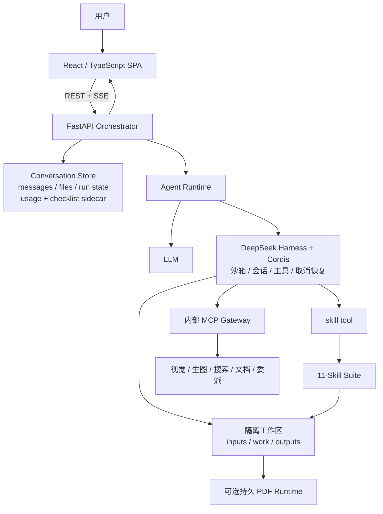

# Hoosland-real-estate-research-toolset

> **LLM + Harness = Agent；Agent + Skill = Tools。**

Hoosland-real-estate-research-toolset 是一套面向房地产研究、产品策略与正式成果交付的可审计 Agent 工具链。LLM 提供推理能力，[DeepSeek Harness](https://github.com/deepseek-ai/deepseek-harness) 与 Cordis 提供受控运行、会话、沙箱和工具调度，11 个 Skill 再把通用 Agent 约束为有范围、有证据、有计算规则、有交付闸门的领域工具。

本仓库包含 **V2 产品线**的完整应用源码和 Skill 套件，不包含模型密钥、客户数据、现网配置、历史发布包或生产凭证。

> **项目阶段与兼容性声明**
>
> 本项目目前仍处于前期 Demo（开发者预览）阶段，主要用于验证架构、工作流与领域 Skill 的可行性，尚未形成稳定的公开接口或数据契约。后续版本可能包含不向后兼容的变更；升级前请阅读对应版本的 `CHANGELOG.md` 与迁移说明，并备份数据和配置。当前版本不承诺生产可用性或长期兼容性。

## 设计公式

- `LLM + Harness = Agent`：模型负责理解与推理；Harness 负责执行循环、工作区、会话、工具、取消和恢复。
- `Agent + Skill = Domain Tools`：Skill 定义触发范围、专业方法、输入输出、证据规则和质量闸门，把 Agent 变成可组合的研究、产策、报告与 QA 工具。
- 这里的 `Domain Tools` 是产品层工具链；代码中的 MCP tools 则是视觉、生图、搜索、文档抽取和文本委派等可选能力适配器。

## 版本矩阵

“V2”是产品线名称，各层独立版本化：

项目正式名称为 `Hoosland-real-estate-research-toolset`。既有 Skill suite ID `real-estate-expert-suite` 及 11 个 Skill ID 作为版本化运行协议继续保留，不随仓库改名。

| 层 | 当前版本 | 说明 |
|---|---:|---|
| 工作台应用 | `0.2.6` | FastAPI、React、API、文件、长任务恢复、任务清单与管理配置 |
| 线上 Build | `v0.2.6-scope-gate-20260829T101331Z` | V2 / slot-b；对话 scope/egress 防护已上线 |
| System Prompt | `real-estate-system-v0.2.4` | 全局身份、安全、证据、权限、任务复核和交付规则 |
| Skill 套件 | `2.3.1` | 1 个总控 + 10 个专项 Skill |
| 项目状态 Schema | `2.1.0` | Skill 使用的 project_state / case payload 契约，本次不变 |
| Conversation usage sidecar Schema | `1` | 可选 `usage.json` accounting projection；兼容、惰性创建 |
| Run checklist sidecar Schema | `1` | 按新 run 惰性创建；旧对话无需迁移 |

V0.2.6 在 V0.2.5 的运行协调基础上统一应用版本身份，并增加对话 scope gate 与 egress gate：闲聊、运行信息/技能清单/模型配置刺探，以及混入项目话术的内部元数据提取请求，在进入 Harness 前本地拒绝；最终文本和文件输出也会对内部运行标记 fail closed。Build `v0.2.6-scope-gate-20260829T101331Z` 已上线 V2 / slot-b，V0.2.5 scope-gate release 作为直接回滚点保留。

## 核心能力

- 项目、多对话、附件、历史记录和成果文件管理；
- REST + SSE 长任务，支持取消、失败重试和页面刷新后的后台任务恢复；
- 每轮把需求拆成任务与成果要求，执行中逐项同步；已有持久化基线时，应用拒绝的后续本地快照会在同一会话中恢复到权威状态，终态同时保留已完成与未完成的复核结果；
- 按 conversation 累计并实时展示主 Agent、子 Agent、重试与压缩步骤中可观察到的 Provider Token 用量；
- 每个对话独立使用 `inputs / work / outputs` 工作区；
- 服务端在每轮 Prompt 首行确定性提交 `comprehensive-real-estate-expert` 总控命令，再由总控依据 Skill 描述调用所需子 Skill；用户不需要记忆 slash command；
- 文件型正式交付链：**总控 → 业务专项 → 编辑 → 设计 → 按需 PDF → 交付 QA**；
- 地产研究、项目分析、策划方案和管理报告在用户未指定格式时默认交付 Markdown + 独立 HTML；安装持久 PDF runtime 后可按需生成并逐页检查 PDF；
- 内部 MCP 能力网关：视觉、生图、扩展搜索、文档抽取、文本委派；未配置时明确失败，不伪造结果；
- Provider 密钥加密保存且 API 不回传明文；运行日志不记录消息正文、附件内容或工具结果。

## 架构



详细设计见 [架构说明](docs/ARCHITECTURE.md)。

## 仓库结构

```text
backend/                 FastAPI、Harness SDK 编排、存储与 MCP 网关
frontend/                React + TypeScript + Vite 工作台
skills/                  v2.3.1 的 11 个领域 Skill、脚本和 smoke tests
deploy/pdf-tool/         HTML → PDF 与逐页检查的持久运行时
deploy/nginx/            脱敏 Nginx 示例
deploy/systemd/          脱敏 systemd 示例
docs/                    使用、配置、架构、部署和迭代原则
scripts/                 一键本地验证脚本
```

## 环境要求

- 完整 Agent runtime：Linux x64/arm64（glibc 2.28+）或 macOS 14+ Apple Silicon；Windows 使用 WSL2，原生 Windows 与 Intel Mac 当前不支持；
- Python `3.11`；
- Node.js `^20.19.0 || >=22.12.0`；
- POSIX shell（运行 Skill smoke tests）；
- 可用的 DeepSeek 或兼容模型凭证；
- PDF 另需 Playwright Chromium、Poppler 以及 `deploy/pdf-tool` 中的持久运行时。

DeepSeek Harness 仍处于快速迭代阶段，本仓库固定使用 `deepseek-harness-sdk==0.1.1rc1` 和对应 runtime bin。升级前必须先通过完整回归测试。

## 快速启动

### 1. 获取代码

```bash
git clone https://github.com/manhoolee/Hoosland-real-estate-research-toolset.git
cd Hoosland-real-estate-research-toolset
```

仓库为公开仓库，可直接克隆；模型及可选 Provider 的凭证仍需由部署者自行配置。

### 2. 启动后端

```bash
cd backend
python3.11 -m venv .venv
. .venv/bin/activate
python -m pip install -r requirements.txt

export APP_ENV=development
export APP_SLOT=local
export PORT=8000
export HARNESS_SKILL_DIRS=../skills
export DEEPSEEK_API_KEY='your-key'

python -m uvicorn app.main:app \
  --host 127.0.0.1 --port 8000 --workers 1
```

应用不会自动读取 `backend/.env.example`。可以导出环境变量，或复制为未入库的 `.env.local` 并使用 Uvicorn 的 `--env-file .env.local`。

`PORT` 必须与 Uvicorn 的 `--port` 一致；否则应显式设置 `CAPABILITY_MCP_URL`。当前锁、取消和 runner 协调在进程内，**必须保持 `--workers 1`**。

### 3. 启动前端

```bash
cd frontend
npm ci
npm run dev
```

打开 <http://127.0.0.1:5173>。开发服务器默认把 `/api` 代理到 `http://127.0.0.1:8000`；可通过 `VITE_API_PROXY_TARGET` 修改。

### 4. 检查状态

```bash
curl http://127.0.0.1:8000/api/health/live
curl http://127.0.0.1:8000/api/health/ready
curl http://127.0.0.1:8000/api/capabilities
```

没有主模型密钥或 Harness runtime 时，`live` 可以正常而 `ready` 返回降级状态；这是预期的 fail-closed 行为。

完整步骤见 [安装指南](docs/INSTALLATION.md)、[使用说明](docs/USAGE.md) 和 [配置参考](docs/CONFIGURATION.md)。

## 11 个领域工具

| Skill | 职责 |
|---|---|
| `comprehensive-real-estate-expert` | 应用每轮提交入口命令所指向的唯一总控、范围、证据和质量闸门 |
| `real-estate-research` | 城市、规划、土地、市场、竞品和客群研究 |
| `real-estate-product-strategy` | 定位、面积、户配、价格、货值和节奏 |
| `real-estate-storyline-marketing` | 品牌故事、营销策略、内容和销售话术 |
| `real-estate-community-operations` | 社群、私域、老带新和客户价值 |
| `wechat-article-exporter` | 微信资料转换与研究归档 |
| `real-estate-report-editorial` | 管理层正式文稿编辑 |
| `real-estate-report-design` | 报告视觉与多端版式方法 |
| `real-estate-delivery-qa` | 事实、数据、文件与视觉放行检查 |
| `real-estate-social-promotion` | 已审定母稿的平台内容审批包 |
| `hoosland-pdf-output` | HTML → PDF 与逐页技术质检，不承担最终发布放行 |

## 验证

```bash
bash ./scripts/test.sh
```

也可以分层运行：

```bash
cd backend
PYTHONPATH=. python -m unittest discover -s tests -v
python -m compileall -q app tests

cd ../frontend
npm run check
npm run build

cd ../skills
bash ./tests/run_smoke_tests.sh
```

当前线上 V2 / slot-b 为 V0.2.6。159 项后端回归、Python 编译、前端检查与构建、隔离候选和生产健康/路由/刺探 smoke 全部通过。V0.2.6 在 V0.2.5 的运行协调基础上增加对话 scope gate 与 egress gate；V0.2.5 scope-gate release 作为直接回滚点保留。V1、Nginx 与 Skill v2.3.1 前后指纹一致，未进入本次变更范围。

## 数据与安全边界

- 对话、附件、过程文件、成品和 Harness session 按 conversation 隔离；
- `usage.json` 是每个 conversation 下独立、可选的统计 sidecar，不包含消息正文；其独立 Schema 为 `1`，缺失时按 0 处理，不改变 project_state Schema `2.1.0`；
- 运行清单按 `run_id` 保存为独立 sidecar Schema `1`，不写入 content-free 的 `run.json`；V0.2.3 回滚代码会忽略它；
- 管理配置中的 API 密钥加密保存，但业务消息和附件本身不是应用层全量加密；
- 管理员登录保护历史列表和配置后台，不构成完整的多租户 IAM；
- `/mcp` 仅供内部 Harness 使用，生产反向代理应阻断公网访问；
- 任何发布、发送、权限变更或外部系统写操作都需要单独明确授权；
- Skill 提供方法和质量闸门，不替代法律、规划、工程、财务或投资专业复核。

更多边界见 [安全政策](SECURITY.md)。

## 迭代原则

核心原则是：分层演进、单一可信源、能力真实、状态隔离、不可变发布、幂等恢复、证据可复核、正式成果必须经过完整交付闸门。详见 [迭代原则](docs/ITERATION-PRINCIPLES.md)。

## 当前限制

- 当前是开发者预览，不应直接宣称为稳定生产版；
- Uvicorn 仅支持单 worker；水平扩容前需要集中存储与分布式协调；
- 可选 MCP 能力是否可用取决于各部署的 Provider 配置；
- Office 深度抽取和 Word/PPT/Excel 交付依赖具体运行时或 Provider，不属于默认开箱能力；
- PDF 安装脚本以 Linux 持久运行时为基线；
- 原生 Windows、Intel Mac 与 Alpine / musl 当前没有匹配的 bundled Harness runtime wheel；
- 尚未提供 Docker Compose 和自动数据迁移器。

## 文档

- [文档总索引](docs/INDEX.md)
- [安装指南](docs/INSTALLATION.md)
- [使用说明](docs/USAGE.md)
- [配置参考](docs/CONFIGURATION.md)
- [架构说明](docs/ARCHITECTURE.md)
- [Skill 编排](docs/SKILL-ORCHESTRATION.md)
- [独立知识提纯库开发文档（Draft）](docs/KNOWLEDGE-REFINERY-CORE-DEVELOPMENT.md)
- [独立知识提纯库开发步骤（Draft）](docs/KNOWLEDGE-REFINERY-CORE-IMPLEMENTATION-PLAN.md)
- [知识决策系统开发文档（Draft）](docs/KNOWLEDGE-DECISION-SYSTEM-DEVELOPMENT.md)
- [知识决策系统敏捷方案（Draft）](docs/KNOWLEDGE-DECISION-SYSTEM-AGILE-IMPLEMENTATION-PLAN.md)
- [项目语料采集工作步骤（Draft）](docs/PROJECT-CORPUS-ACQUISITION-WORKFLOW.md)
- [版本与升级](docs/VERSIONING-AND-UPGRADES.md)
- [测试与验收](docs/TESTING-AND-ACCEPTANCE.md)
- [部署说明](docs/DEPLOYMENT.md)
- [迭代原则](docs/ITERATION-PRINCIPLES.md)
- [V0.2.6 发布说明](docs/releases/v0.2.6/RELEASE-NOTES.md)
- [V0.2.5 发布说明](docs/releases/v0.2.5/RELEASE-NOTES.md)
- [V0.2.4 发布说明](docs/releases/v0.2.4/RELEASE-NOTES.md)
- [V0.2.3 发布说明](docs/releases/v0.2.3/RELEASE-NOTES.md)
- [V0.2.2 发布说明](docs/releases/v0.2.2/RELEASE-NOTES.md)
- [V0.2.1 发布说明](docs/releases/v0.2.1/RELEASE-NOTES.md)
- [V0.2.0 发布说明](docs/releases/v0.2.0/RELEASE-NOTES.md)
- [更新记录](CHANGELOG.md)
- [贡献指南](CONTRIBUTING.md)

## 许可

代码、脚本、配置、Skill 规则和模板采用 [MIT License](LICENSE)；原创说明、方法文档与示例内容采用 [CC BY 4.0](LICENSE-CONTENT.md)。第三方项目、资料和品牌不在本仓库的再授权范围内，详见 [NOTICE](NOTICE)。
