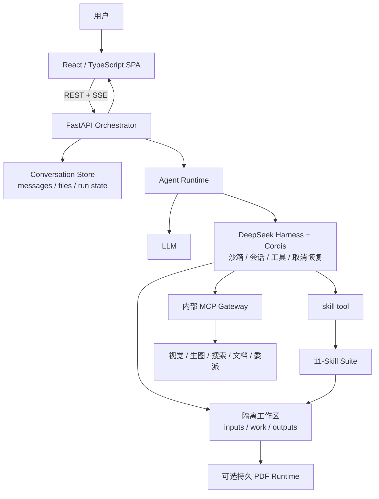

# Hoosland Agent Tools V2

> **LLM + Harness = Agent；Agent + Skill = Tools。**

Hoosland Agent Tools 是一套面向房地产研究、产品策略与正式成果交付的可审计 Agent 工具链。LLM 提供推理能力，[DeepSeek Harness](https://github.com/deepseek-ai/deepseek-harness) 与 Cordis 提供受控运行、会话、沙箱和工具调度，11 个 Skill 再把通用 Agent 约束为有范围、有证据、有计算规则、有交付闸门的领域工具。

本仓库是 **V2 产品线的开发者预览版**。它包含完整应用源码和 Skill 套件，不包含模型密钥、客户数据、现网配置、历史发布包或生产凭证。

## 设计公式

- `LLM + Harness = Agent`：模型负责理解与推理；Harness 负责执行循环、工作区、会话、工具、取消和恢复。
- `Agent + Skill = Domain Tools`：Skill 定义触发范围、专业方法、输入输出、证据规则和质量闸门，把 Agent 变成可组合的研究、产策、报告与 QA 工具。
- 这里的 `Domain Tools` 是产品层工具链；代码中的 MCP tools 则是视觉、生图、搜索、文档抽取和文本委派等可选能力适配器。

## 版本矩阵

“V2”是产品线名称，各层独立版本化：

| 层 | 当前版本 | 说明 |
|---|---:|---|
| 工作台应用 | `0.2.0` | FastAPI、React、API、文件、长任务恢复与管理配置 |
| System Prompt | `real-estate-system-v0.2.0` | 全局身份、安全、证据、权限和交付规则 |
| Skill 套件 | `2.3.0` | 1 个总控 + 10 个专项 Skill |
| 项目状态 Schema | `2.1.0` | 兼容既有 case state；只有数据契约变化并提供迁移器时才升级 |

## 核心能力

- 项目、多对话、附件、历史记录和成果文件管理；
- REST + SSE 长任务，支持取消、失败重试和页面刷新后的后台任务恢复；
- 每个对话独立使用 `inputs / work / outputs` 工作区；
- DeepSeek Harness 依据 Skill 描述自动路由，不要求用户记忆 slash command；
- 固定正式交付链：**业务专项 → 编辑 → 设计 → 按需 PDF → 交付 QA**；
- 默认交付 Markdown + 独立 HTML；安装持久 PDF runtime 后可按需生成并逐页检查 PDF；
- 内部 MCP 能力网关：视觉、生图、扩展搜索、文档抽取、文本委派；未配置时明确失败，不伪造结果；
- Provider 密钥加密保存且 API 不回传明文；运行日志不记录消息正文、附件内容或工具结果。

## 架构



详细设计见 [架构说明](docs/ARCHITECTURE.md)。

## 仓库结构

```text
backend/                 FastAPI、Harness SDK 编排、存储与 MCP 网关
frontend/                React + TypeScript + Vite 工作台
skills/                  v2.3.0 的 11 个领域 Skill、脚本和 smoke tests
deploy/pdf-tool/         HTML → PDF 与逐页检查的持久运行时
deploy/nginx/            脱敏 Nginx 示例
deploy/systemd/          脱敏 systemd 示例
docs/                    使用、配置、架构、部署和迭代原则
scripts/                 一键本地验证脚本
```

## 环境要求

- 完整 Agent runtime：Linux x64/arm64（glibc 2.28+）或 macOS 14+ Apple Silicon；Windows 使用 WSL2，原生 Windows 与 Intel Mac 当前不支持；
- Python `3.11`；
- Node.js `^20.19.0 || >=22.12.0`；
- POSIX shell（运行 Skill smoke tests）；
- 可用的 DeepSeek 或兼容模型凭证；
- PDF 另需 Playwright Chromium、Poppler 以及 `deploy/pdf-tool` 中的持久运行时。

DeepSeek Harness 仍处于快速迭代阶段，本仓库固定使用 `deepseek-harness-sdk==0.1.1rc1` 和对应 runtime bin。升级前必须先通过完整回归测试。

## 快速启动

### 1. 获取代码

```bash
git clone https://github.com/manhoolee/hoosland-agent-tools.git
cd hoosland-agent-tools
```

仓库当前为私有可见性，克隆账户需要先取得访问权限。

### 2. 启动后端

```bash
cd backend
python3.11 -m venv .venv
. .venv/bin/activate
python -m pip install -r requirements.txt

export APP_ENV=development
export APP_SLOT=local
export PORT=8000
export HARNESS_SKILL_DIRS=../skills
export DEEPSEEK_API_KEY='your-key'

python -m uvicorn app.main:app \
  --host 127.0.0.1 --port 8000 --workers 1
```

应用不会自动读取 `backend/.env.example`。可以导出环境变量，或复制为未入库的 `.env.local` 并使用 Uvicorn 的 `--env-file .env.local`。

`PORT` 必须与 Uvicorn 的 `--port` 一致；否则应显式设置 `CAPABILITY_MCP_URL`。当前锁、取消和 runner 协调在进程内，**必须保持 `--workers 1`**。

### 3. 启动前端

```bash
cd frontend
npm ci
npm run dev
```

打开 <http://127.0.0.1:5173>。开发服务器默认把 `/api` 代理到 `http://127.0.0.1:8000`；可通过 `VITE_API_PROXY_TARGET` 修改。

### 4. 检查状态

```bash
curl http://127.0.0.1:8000/api/health/live
curl http://127.0.0.1:8000/api/health/ready
curl http://127.0.0.1:8000/api/capabilities
```

没有主模型密钥或 Harness runtime 时，`live` 可以正常而 `ready` 返回降级状态；这是预期的 fail-closed 行为。

完整步骤见 [安装指南](docs/INSTALLATION.md)、[使用说明](docs/USAGE.md) 和 [配置参考](docs/CONFIGURATION.md)。

## 11 个领域工具

| Skill | 职责 |
|---|---|
| `comprehensive-real-estate-expert` | 跨模块总控、范围、证据和质量闸门 |
| `real-estate-research` | 城市、规划、土地、市场、竞品和客群研究 |
| `real-estate-product-strategy` | 定位、面积、户配、价格、货值和节奏 |
| `real-estate-storyline-marketing` | 品牌故事、营销策略、内容和销售话术 |
| `real-estate-community-operations` | 社群、私域、老带新和客户价值 |
| `wechat-article-exporter` | 微信资料转换与研究归档 |
| `real-estate-report-editorial` | 管理层正式文稿编辑 |
| `real-estate-report-design` | 报告视觉与多端版式方法 |
| `real-estate-delivery-qa` | 事实、数据、文件与视觉放行检查 |
| `real-estate-social-promotion` | 已审定母稿的平台内容审批包 |
| `hoosland-pdf-output` | HTML → PDF 与逐页技术质检，不承担最终发布放行 |

## 验证

```bash
bash ./scripts/test.sh
```

也可以分层运行：

```bash
cd backend
PYTHONPATH=. python -m unittest discover -s tests -v
python -m compileall -q app tests

cd ../frontend
npm run check
npm run build

cd ../skills
bash ./tests/run_smoke_tests.sh
```

本次源码快照已通过 83 个后端单元测试、Python 编译、前端类型检查与生产构建、Skill v2.3 smoke tests。自动化测试不等同于真实模型、真实 Provider、浏览器和 PDF 的生产验收。

## 数据与安全边界

- 对话、附件、过程文件、成品和 Harness session 按 conversation 隔离；
- 管理配置中的 API 密钥加密保存，但业务消息和附件本身不是应用层全量加密；
- 管理员登录保护历史列表和配置后台，不构成完整的多租户 IAM；
- `/mcp` 仅供内部 Harness 使用，生产反向代理应阻断公网访问；
- 任何发布、发送、权限变更或外部系统写操作都需要单独明确授权；
- Skill 提供方法和质量闸门，不替代法律、规划、工程、财务或投资专业复核。

更多边界见 [安全政策](SECURITY.md)。

## 迭代原则

核心原则是：分层演进、单一可信源、能力真实、状态隔离、不可变发布、幂等恢复、证据可复核、正式成果必须经过完整交付闸门。详见 [迭代原则](docs/ITERATION-PRINCIPLES.md)。

## 当前限制

- 当前是开发者预览，不应直接宣称为稳定生产版；
- Uvicorn 仅支持单 worker；水平扩容前需要集中存储与分布式协调；
- 可选 MCP 能力是否可用取决于各部署的 Provider 配置；
- Office 深度抽取和 Word/PPT/Excel 交付依赖具体运行时或 Provider，不属于默认开箱能力；
- PDF 安装脚本以 Linux 持久运行时为基线；
- 原生 Windows、Intel Mac 与 Alpine / musl 当前没有匹配的 bundled Harness runtime wheel；
- 尚未提供 Docker Compose 和自动数据迁移器。

## 文档

- [安装指南](docs/INSTALLATION.md)
- [使用说明](docs/USAGE.md)
- [配置参考](docs/CONFIGURATION.md)
- [架构说明](docs/ARCHITECTURE.md)
- [部署说明](docs/DEPLOYMENT.md)
- [迭代原则](docs/ITERATION-PRINCIPLES.md)
- [更新记录](CHANGELOG.md)
- [贡献指南](CONTRIBUTING.md)

## 许可

代码、脚本、配置、Skill 规则和模板采用 [MIT License](LICENSE)；原创说明、方法文档与示例内容采用 [CC BY 4.0](LICENSE-CONTENT.md)。第三方项目、资料和品牌不在本仓库的再授权范围内，详见 [NOTICE](NOTICE)。
