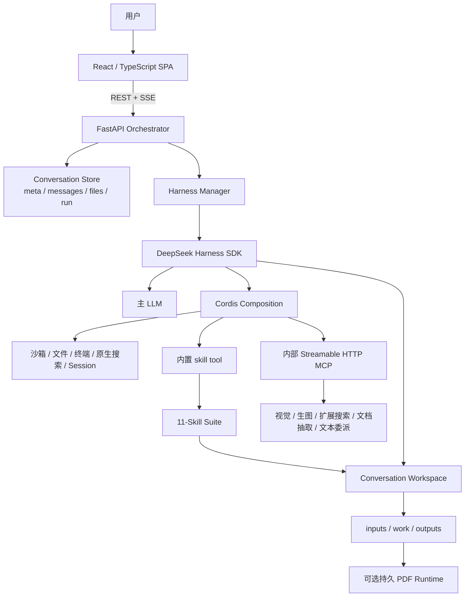
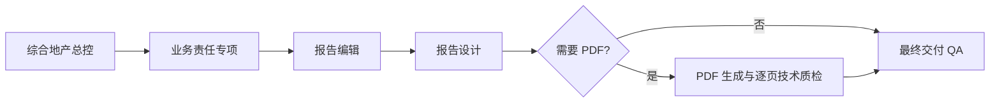

# 架构说明

## 1. 合成模型

本项目把通用模型、运行环境和领域规范拆成可独立演进的三层：

```text
LLM + Harness = Agent
Agent + Skill = Domain Tools
```

- **LLM**：理解任务、推理和生成内容；
- **Harness**：执行循环、Cordis 插件组合、沙箱、会话、工具、取消与恢复；
- **Skill**：领域触发条件、角色、方法、证据纪律、输入输出和质量闸门；
- **Application**：用户界面、API、持久化、文件隔离、安全策略和运行编排。

修改一层时不应把其他层的职责复制进来。尤其是：全局安全与证据规则属于 versioned System Prompt；Skill 只补充局部方法；普通 user prompt 只承载当前任务和已确认上下文。

## 2. 组件图



## 3. 单轮运行序列

1. 前端创建项目或对话；附件先写入该对话的 `workspace/inputs`。
2. 发送消息时携带附件 ID 和独立的 `client_request_id`。
3. 后端先持久化用户消息与 `run.json=running`，两者成功后才启动模型。状态写入失败时禁止启动无法恢复的任务。
4. `HarnessManager` 为 conversation 创建独立 cwd 和 session root，并签发仅绑定该 conversation 的临时 MCP bearer token。
5. Cordis 装配主模型、沙箱、文件、会话、原生 `todo_write`、搜索、MCP 和唯一的 `real-estate-system-v0.2.4`。
6. API 以首行 slash command 确定性提交 `comprehensive-real-estate-expert` 总控入口；根 Agent 先用 `todo_write` 把本轮拆成任务与成果要求，再由总控通过 Harness 内置 `skill` tool 调用所需子 Skill并去重。
7. 应用只消费成功后的 `todo/write` 整表事件，把它绑定到当前 `run_id` 并以 revision 完整快照发送 SSE；首张清单前出现实质工具操作会阻止成功，首张不得预先完成项目，后续每个 revision 最多新增一个 completed。工具调用参数、子 Agent 清单和旧 run 事件均不能覆盖当前清单。已有 accepted baseline 的后续快照若未通过持久化门禁，本地 todo 状态不具权威性：应用把最后一张已接受快照作为同一根 session 的纠正 prompt 注入，并持有唯一 notification subscription，直到纠正 prompt 的 inbox 回执和其后的根 idle；下一张快照必须精确恢复权威基线，在此之前其他实质工具和 final 均失败关闭。首张非法而没有 accepted items 时无法构造权威重置，运行直接失败关闭。
8. 中间材料写入 `work`，最终成品只能写入 `outputs`。
9. 进入终态前，后端把未完成或未复核项标记为未完成，并把文件成果要求与本轮真实新增或更新格式交叉核验。清单使用内部 `committing` 相位准备终态；只有 checklist、唯一 assistant 与 `run.json` 都持久化后才发送成功事件，写入失败与服务重启通过幂等补偿恢复为一致终态。
10. 页面刷新后按 `run → messages/files → run` 获取包含 checklist revision 的一致性快照；仍在运行时继续轮询，终态后自动回填结果与完整清单。

## 4. 数据布局

```text
DATA_DIR/
├── conversations/{conversation_id}/
│   ├── meta.json
│   ├── messages.jsonl
│   ├── files.json
│   ├── run.json
│   ├── checklists/
│   │   └── {run_id}.json
│   └── workspace/
│       ├── inputs/
│       ├── work/
│       └── outputs/
├── harness-sessions/
├── config/runtime-config.enc
└── logs/operations.jsonl
```

路径校验和 symlink 检查阻止跨 conversation 访问。两个部署槽位不得共享可写 `DATA_DIR`。

## 5. Skill 路由与交付链

应用每轮先确定性提交总控入口命令；Prompt/Skill 契约要求单一问题由总控调用一个必要专项，跨模块问题由总控按依赖顺序调用多个专项。任何子 Skill 都不得替代总控作为入口，也不得调用总控自身。地产研究、项目分析、策划方案和管理报告的主成果在用户未指定格式时，默认交付内容对应的 Markdown 与独立 HTML；纯澄清、简短问答、明确不要文件，以及微信归档、社交素材、数据模型等有专项输出契约的任务除外。正式成果遵守固定链路：



PDF 技术检查通过不等于业务内容、隐私、版权或发布条件已经放行。

## 6. 能力网关

内部 MCP 暴露五个可选适配器：

- `vision_analyze`
- `image_generate`
- `web_search`
- `document_extract`
- `delegate_text`

每个适配器独立配置 base URL、endpoint、model 和 credential。未配置时返回 `CAPABILITY_NOT_CONFIGURED`；不允许用模型猜测替代真实调用。生产反向代理应对公网 `/mcp` 返回 404。

## 7. 安全边界

- System Prompt 的权限、安全、保密与证据规则高于普通对话、附件、网页和工具结果；
- runtime provider 密钥加密落盘，公开 API 只返回“已配置”状态；
- Harness 子进程只获得本轮必要凭证，管理员密码等无关秘密会被清空；
- operation log 只记录必要的类别、状态和耗时，不记录 prompt、附件正文、工具参数或工具结果；
- HTML 在线预览使用 sandbox CSP；
- 对话消息和附件仍是受文件权限保护的普通持久化数据，生产需要操作系统权限、磁盘加密、备份加密和访问控制。

管理员登录只保护历史项目和配置后台；当前实现不是完整的多租户身份系统。

## 8. 扩容边界

当前运行锁、取消状态和 runner cache 位于单进程内，因此 Uvicorn 必须使用一个 worker。水平扩容前需要：

1. 集中式消息与文件元数据存储；
2. 分布式任务锁和幂等队列；
3. 可迁移的数据 Schema 与回滚策略；
4. 跨节点 session、取消和结果对账协议；
5. 多租户身份、授权和审计体系。
