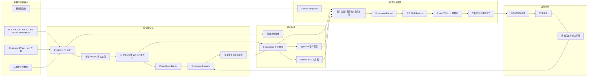

# Hoosland 项目经验知识图谱与专业决策引擎开发文档

文档状态：`Draft`  
文档版本：`0.2.0`  
编写日期：`2026-08-26`  
适用范围：Hoosland V2 后续知识能力演进  
首期业务范围：住宅项目研究与产品策略  
架构决策：[ADR-0005：Harness 插件、Skill 与知识层边界](adr/0005-harness-plugin-and-knowledge-boundaries.md)  
核心库规范：[独立知识提纯库开发文档](KNOWLEDGE-REFINERY-CORE-DEVELOPMENT.md)  
核心库计划：[独立知识提纯库开发步骤与敏捷实施计划](KNOWLEDGE-REFINERY-CORE-IMPLEMENTATION-PLAN.md)  

## 0. 文档结论

本项目不是在现有工作台上增加一个普通 RAG，也不是继续堆叠 Skill。目标是在原始资料与 Skill 之间建设一层可持久化、可审核、可追溯、可计算、可按条件激活的**领域知识层**，将历史项目中的事实、判断、动作、结果和反例编译为 `KnowledgeUnit`，再由专业 Skill 在分析新项目时调用。

目标公式：

```text
LLM + 项目经验知识库 + 专业 Skill + 结果评测闭环
=
可追溯的领域决策系统
```

核心数据链：

```text
原始资料
→ 格式化数据
→ 项目案例
→ 候选知识
→ 专家审核知识
→ 新项目条件比对
→ Skill 专业分析
→ 逐结论核验
→ 决策与结果回灌
```

第一阶段先开发零 Harness 依赖的独立知识提纯核心，通过 CLI、pytest 和独立存储跑通“证据—案例—候选—审核—版本—快照”。核心达到内部 Beta 后，才以侧车方式接入现有工作台：保留会话、Harness、Skill、文件工作区和部署链路，通过 Application adapter 和只读 MCP Tool 消费正式知识。首期不重写现有工作台，也不迁移全部 conversation 数据。

## 1. 背景与问题

当前系统已经具备：

- React + FastAPI 项目研究工作台；
- 项目、对话、附件、成果和长任务恢复；
- DeepSeek Harness 与总控 Skill 编排；
- 1 个总控和 10 个专业 Skill；
- `FACT / DERIVED / INFERENCE / HYPOTHESIS / RECOMMENDATION` 主张分类；
- 来源等级、范围、日期、单位、假设、计算许可和交付闸门；
- 产品测算脚本、运行审计、自动化测试和不可变发布基础。

但现有“项目”主要是 conversation 分组，资料和成果仍以对话文件为中心。系统尚未具备以下能力：

1. 多个历史项目共享、复用和版本化的资料库；
2. 从资料中稳定抽取证据、事实、指标、决策和结果；
3. 将多个项目经验提炼成有适用条件和反例的领域知识；
4. 对知识进行专家审核、发布、废止、回滚和时效管理；
5. 按新项目条件而不是文本相似度选择历史经验；
6. 记录某次 Skill 实际使用了哪些知识和证据；
7. 用后续项目结果校准知识与 Skill 的有效性。

仅使用 RAG 会把“文本相似”误认为“业务条件相同”；仅使用 Skill 则只能保存通用方法，无法承载不断增长的项目事实和组织经验。因此必须增加独立的领域知识层。

## 2. 核心概念与分层

### 2.1 RAG、KnowledgeUnit 与 Skill 的区别

| 层 | 主要内容 | 是否可执行 | 是否经过审核 | 典型用途 |
|---|---|---:|---:|---|
| 原始资料 / RAG Chunk | 文件片段、表格、原文和向量索引 | 否 | 通常否 | 找到可能相关的原始证据 |
| `KnowledgeUnit` | 有条件、证据、反例、有效期和版本的领域经验 | 否 | 正式发布版本：是 | 判断某条经验能否用于当前项目 |
| Skill | 方法、步骤、工具调用、计算和输出契约 | 是 | 版本化维护 | 使用知识完成专业任务 |

`KnowledgeUnit` 是介于 RAG 与 Skill 之间的核心能力：

- 它不是原文摘要；
- 它不是 Prompt；
- 它不直接执行任务；
- 它描述“在什么条件下，什么经验可能成立；证据是什么；哪些情况会失效”；
- 它必须由 Skill 通过稳定工具契约调用。

### 2.2 五层知识结构

```text
证据层：DocumentVersion / EvidenceSpan
事实层：Claim / MetricObservation / Assumption
案例层：ProjectCase / Context / Decision / Action / Outcome
知识层：KnowledgeUnit / Counterexample / KnowledgeRelation
运行层：SkillContract / SkillRun / AnalysisRun / EvaluationResult
```

### 2.3 项目案例的时间边界

一个真实项目不应只有一个 `ProjectCase`。同一项目在拿地、定位、首开、在售、交付和复盘阶段拥有不同信息集和决策问题，应形成多个按决策时间截断的案例快照。

分析历史项目时只能使用当时已经可获得的信息，不得把未来成交、回款或交付结果泄漏到当时判断中。

## 3. 产品目标与非目标

### 3.1 产品目标

1. 将历史资料转化为统一、可校验的项目案例。
2. 将多个项目案例编译为可复用的候选领域知识。
3. 通过专家审核发布正式知识，并保存完整版本和证据血缘。
4. 对新项目进行条件匹配、相似案例与反例对比。
5. 让 Skill 消费结构化知识包，而不是把整库文本塞进上下文。
6. 对模型输出逐条核验来源、时效、范围、单位和计算。
7. 记录实际决策、动作和结果，持续评估知识与 Skill。
8. 所有正式结论均可回到原始文件的页码、段落或表格单元格。

### 3.2 首期非目标

- 不让 LLM 自动把候选知识晋升为正式经验；
- 不试图一次建立覆盖地产全链路的庞大本体；
- 不在 PoC 阶段重写现有会话、Harness 和部署系统；
- 不把图数据库中的关系自动视为已确认事实；
- 不只根据向量相似度迁移案例结论；
- 不把系统输出描述为替代投委会、法律、规划、财务或工程专业审核；
- 不在首期同时改造编辑、设计、PDF、社交发布等全部 Skill；
- 不承诺仅凭现有两份参考报告证明领域知识有效。

## 4. 设计原则

1. **原始证据不可变**：原文件和版本哈希一经入库不得原地覆盖。
2. **关系表是权威状态源**：关键数值、状态、权限和版本以 PostgreSQL 关系表为准。
3. **图和向量是可重建投影**：图关系、embedding 和摘要可从权威数据重建。
4. **LLM 只产生候选**：抽取、归纳和判断均需要规则检查或专家批准。
5. **适用条件优先于相似度**：先过硬条件，再做图查询、数值比较和语义召回。
6. **支持案例与反例并列**：正式知识必须主动检索失效案例。
7. **证据与知识分层**：原文、事实、判断、经验和执行规则不得混存为同一对象。
8. **双时间语义**：区分业务事实有效时间与系统记录时间。
9. **三值条件逻辑**：条件结果为 `true / false / unknown`；未知不得默认当作满足。
10. **渐进核验**：发布门从 `off → shadow → warn → strict` 逐步开启。
11. **运行快照可复现**：每次分析冻结资料、知识、Skill、模型和 Prompt 版本。
12. **结果不等于因果**：优先使用“与结果一致/不一致”，未经设计不得声称因果成立。

## 5. 总体架构



### 5.1 与现有系统的集成边界

PoC 阶段不在现有 FastAPI Orchestrator 中直接实现领域核心。即使使用同一 Git 仓库，也建立独立 Python package，并保持单向依赖：

```text
packages/knowledge-refinery
├─ Domain / Application / Ports
├─ Infrastructure Adapters
├─ Standalone CLI / API / Worker
└─ Golden Set / Evaluation

Hoosland Application
└─ knowledge_adapter → Standalone Knowledge Query API

DeepSeek Harness
└─ read-only MCP adapter → Standalone Knowledge Query API
```

核心包禁止导入 Harness、MCP、FastAPI route、现有 Agent 状态和具体模型 SDK。原始文件首期可以继续使用受控磁盘；生产阶段可替换为 S3 兼容对象存储。知识元数据、状态、数值和版本进入 PostgreSQL。详细包结构、领域契约和依赖测试见[独立知识提纯库开发文档](KNOWLEDGE-REFINERY-CORE-DEVELOPMENT.md)。

### 5.2 推荐技术栈

| 层 | 推荐方案 | 说明 |
|---|---|---|
| API | 独立 FastAPI adapter，后接现有 Application | 核心库本身不依赖 Web 框架；接入后复用现有认证和运行机制 |
| 权威数据库 | PostgreSQL | 文档、案例、知识、审核、运行和评测状态 |
| 图查询 | Apache AGE | 在同一 PostgreSQL 内执行 openCypher；PoC 前验证部署环境 |
| 语义召回 | pgvector | 只用于候选召回，不作为事实源 |
| 关键词检索 | PostgreSQL FTS | 与结构化过滤、向量召回组合 |
| 数据迁移 | Alembic 或等效迁移器 | 每次 Schema 变化必须可升级和回滚 |
| 异步任务 | PostgreSQL Job Table + Worker | 首期使用 `FOR UPDATE SKIP LOCKED`，暂不强制引入 Redis/Celery |
| 原始文件 | 受控磁盘 → S3 兼容存储 | 文件内容不可变，使用 SHA-256 去重和版本化 |
| 前端 | 现有 React / TypeScript | 新增知识库、审核、图谱、分析和评测页面 |

AGE 不得成为唯一实现前提。如果部署环境无法安装 AGE，关系表必须仍能表达全部核心语义，图谱作为投影可切换到其他图引擎。

### 5.3 Harness 插件与固定产品能力边界

本项目采用 knowledge-core-first 的混合架构，不采用“全部硬编码”或“全部塞进插件”两种极端方案：

```text
DeepSeek Harness / Cordis       Agent 运行控制层
Harness Skill resources         可插拔专业方法
MCP 或薄 Cordis plugin          知识 Tool 适配层
Hoosland Knowledge Service      持久知识、提纯、审核和评测
Hoosland Application Gate       权限、快照、核验、终态和回滚
```

边界规则：

- 单个专业 Skill 继续是 `ctx.skills` provider 管理的 Skill resource，不必为每个 `SKILL.md` 单独开发 Cordis Service plugin；
- 总控 Skill 的内容仍可版本化替换，但“每轮确定性进入总控、缺失时 fail closed”是应用硬约束；
- KnowledgeUnit 是数据库中的版本化数据，不是动态 Skill，也不是 Cordis plugin；
- 知识库、编译器、专家审核、权限、迁移和评测由 Knowledge Service 持久负责；
- Harness 通过 MCP Tool 或薄 Cordis plugin 取得 KnowledgePacket；适配层不保存领域本体和审核状态；
- 核心 PoC 不注册知识 Tool；内部 Beta 通过后再优先复用当前 `@deepseek-ai/dsh-mcp-client` 接入只读知识 Tool，不 fork Harness；
- 只有在需要监听 `agent/*`、`tools/*`、注入 scoped context 或提供原生 UI 时，才开发专用 Cordis plugin；
- 快照、结构校验、知识发布审批和最终 Claim Gate 固定在 Application 层，不交给 Skill 自觉执行。

详细决策、被否决方案和 Tool 权限分级见 [ADR-0005](adr/0005-harness-plugin-and-knowledge-boundaries.md)。

## 6. 模块划分

建议建立独立 package，避免继续扩张现有 `main.py`、`ConversationStore` 或 `harness_adapter.py`：

```text
packages/knowledge-refinery/
├─ src/knowledge_refinery/
│  ├─ domain/              实体、值对象、状态机和领域规则
│  ├─ application/         提纯、审核、发布、查询用例
│  ├─ ports/               Parser、LLM、Repository、Search 等端口
│  ├─ contracts/           ParsedDocument、KnowledgeUnit、KnowledgePacket
│  └─ prompts/             版本化提纯模板
├─ src/knowledge_refinery_adapters/
│  ├─ parsers/             Docling / MarkItDown / X2Knowledge adapters
│  ├─ llm/                 具体 Provider adapters
│  ├─ persistence/         SQLite / PostgreSQL
│  ├─ search/              FTS / pgvector / graph projection
│  └─ object_store/
├─ src/knowledge_refinery_service/
│  ├─ api/
│  ├─ worker/
│  └─ cli/
├─ migrations/
└─ tests/                  unit / architecture / contract / golden / integration

integrations/knowledge-mcp/       核心 Beta 后增加
backend/app/knowledge_adapter/    产品接入时增加
```

## 7. 数据处理与知识编译流程

### 7.1 入库阶段

```text
uploaded
→ security_checked
→ parsed_or_ocr
→ sectioned_and_chunked
→ metadata_enriched
→ normalized
→ indexed
→ case_ready
```

每个入库任务必须保存：

- `job_id` 和幂等键；
- 原文件 SHA-256；
- 文档版本；
- 解析器、OCR、切片器、embedding 和抽取器版本；
- 分阶段进度、心跳、超时、重试次数和错误类型；
- 可取消、可重新入库和 orphan job 恢复状态；
- 所有派生数据的重建入口。

### 7.2 格式化与标准化

格式化阶段不能只把文档转成 Markdown，还必须建立机器可比较的数据契约：

1. 识别项目、城市、板块、期次、宗地、楼栋和产品组团；
2. 为每个范围分配稳定 `scope_id`，保留父子关系；
3. 标准化日期、面积、单价、总价、币种、比例和统计口径；
4. 保存原值、标准化值和转换规则；
5. 把表格定位到工作表、单元格、行列和合并区域；
6. 把 PDF 定位到页码、区域和文本 span；
7. 识别别名，但不静默合并存在歧义的项目或主体；
8. 保存来源权限、可信等级和数据有效期。

### 7.3 ProjectCase 构建

每个案例至少包含：

```text
当时可获得的 ContextSnapshot
+ 已确认 Claim / MetricObservation
+ Assumption 与限制条件
+ 决策问题和备选方案
+ 实际 DecisionRecord
+ 实际 Action
+ 后续 OutcomeObservation
+ 观察窗口与混杂因素
```

缺少实际动作或结果的项目可以作为资料案例，但不得自动作为“成功经验”支持正式 KnowledgeUnit。

### 7.4 知识编译

```text
证据与事实抽取
→ 案例内决策链整理
→ 跨案例模式发现
→ 候选规律或反模式生成
→ 适用条件结构化
→ 主动搜索支持案例与反例
→ 时间截断检查
→ 确定性规则检查
→ 专家审核
→ 发布不可变 KnowledgeUnitVersion
```

首期支持的知识类型：

- `heuristic`：经验性判断；
- `threshold`：有证据支持的阈值或区间；
- `pattern`：跨案例稳定模式；
- `calculation_rule`：可程序复算的计算规则；
- `decision_precedent`：决策先例；
- `anti_pattern`：常见误判或失败模式；
- `exception`：正式知识的例外；
- `checklist`：满足特定条件时应核查的项目；
- `invalidation_signal`：知识需要停用或复审的信号。

## 8. 核心数据模型

### 8.1 实体

| 实体 | 作用 | 关键字段 |
|---|---|---|
| `KnowledgeBase` | 知识库和权限边界 | `id, name, owner, scope, status` |
| `Project` | 项目稳定身份 | `id, canonical_name, aliases, region, project_type` |
| `Scope` | 城市到产品组团的范围树 | `id, type, parent_id, valid_from, valid_to` |
| `Document` | 原始资料逻辑身份 | `id, project_id, source_type, publisher, rights` |
| `DocumentVersion` | 不可变文件版本 | `id, document_id, sha256, as_of_date, parser_version` |
| `EvidenceSpan` | 可打开的原文证据 | `id, version_id, locator, text_hash, extraction_method` |
| `EvidenceSnapshot` | 某次运行冻结的证据集合 | `id, evidence_ids, query, filters, snapshot_hash` |
| `Claim` | 原子事实或判断 | `id, type, subject, predicate, object, scope_id, status` |
| `MetricObservation` | 可比较的数值观察 | `metric, value, unit, denominator, period, methodology` |
| `Assumption` | 模型或判断假设 | `value, range, unit, reason, owner, status` |
| `ProjectCase` | 某决策时点的项目案例 | `project_id, stage, cutoff_at, decision_domain, status` |
| `ContextSnapshot` | 当时条件快照 | `case_id, facts, assumptions, constraints, market_state` |
| `DecisionRecord` | 实际决策 | `options, selected_option, rationale, decided_at, owner` |
| `Action` | 实际执行动作 | `decision_id, action_type, started_at, completed_at` |
| `OutcomeObservation` | 后续实际结果 | `metric, value, observed_at, window, confounders` |
| `KnowledgeUnit` | 领域知识逻辑身份 | `id, domain, type, owner` |
| `KnowledgeUnitVersion` | 不可变知识版本 | `statement, conditions, counter_cases, validity, status` |
| `KnowledgeSnapshot` | 某次分析可见的知识版本集合 | `id, unit_version_ids, policy, snapshot_hash` |
| `ConditionExpression` | 机器可判定的适用与失效条件 | `operator, property, expected_value, unknown_policy` |
| `Counterexample` | 反例一级对象 | `case_id, ku_version_id, type, severity, differing_conditions` |
| `KnowledgeRelation` | 知识关系 | `type, source_id, target_id, evidence_id, valid_time` |
| `CompilationRun` | 知识编译血缘 | `input_snapshot, model, prompt, rules, outputs` |
| `ReviewRecord` | 审核和分歧 | `decision, reviewer, reason, changes, reviewed_at` |
| `SkillContract` | Skill 的机器消费契约 | `input_schema, knowledge_types, conflict_policy` |
| `SkillRun` | Skill 的实际运行记录 | `skill_version, used_knowledge, input_snapshot, output` |
| `AnalysisRun` | 新项目分析总记录 | `case_snapshot, knowledge_snapshot, mode, result_status` |
| `AnalysisResult` | 结构化分析结论 | `claims, recommendations, risks, missing_inputs, trace` |
| `Verification` | 对 Claim 的核验记录 | `status, evidence, deterministic_checks, verifier_version` |
| `EvaluationResult` | 历史回放和结果评估 | `eval_case, versions, metrics, error_class` |

### 8.2 核心关系

```text
DocumentVersion CONTAINS EvidenceSpan
EvidenceSpan SUPPORTS | CONTRADICTS Claim
Claim ABOUT Project | Scope | Entity
Claim DERIVED_FROM Claim | ModelRun

Scope PART_OF Scope
ProjectCase OBSERVED_UNDER ContextSnapshot
ProjectCase CONSIDERED DecisionOption
ProjectCase TOOK_ACTION Action
DecisionRecord BASED_ON Claim | KnowledgeUnitVersion
DecisionRecord EXPECTS OutcomeDefinition
Action LED_TO OutcomeObservation

KnowledgeUnitVersion SYNTHESIZED_FROM ProjectCase | Claim
KnowledgeUnitVersion SUPPORTED_BY ProjectCase
KnowledgeUnitVersion COUNTERED_BY Counterexample
KnowledgeUnitVersion APPLIES_WHEN Condition
KnowledgeUnitVersion FAILS_WHEN Condition
KnowledgeUnitVersion SUPERSEDES KnowledgeUnitVersion

SkillRun USES KnowledgeUnitVersion
SkillRun PRODUCES AnalysisResult
AnalysisResult TRACED_TO Claim | KnowledgeUnitVersion | EvidenceSpan
EvaluationResult EVALUATES SkillRun | KnowledgeUnitVersion
```

`LED_TO` 只记录时间和业务链路，不自动代表已证明因果；需要因果判断时必须另建审核后的关系类型和证据标准。

### 8.3 KnowledgeUnitVersion 契约

```yaml
knowledge_unit_id: KU-PRODUCT-001
version: 1.0.0
decision_domain: product_mix
type: heuristic
statement: 结构化领域结论

required_inputs:
  - property: project.product.avg_unit_area
    unit: sqm

output_semantics:
  target: recommendation.product_mix
  value_schema: ProductMixRecommendation

applicability:
  all_of: []
  any_of: []
  unknown_policy: abstain

invalid_conditions: []
invalidation_signals: []

supporting_case_ids: []
counterexample_ids: []
evidence_ids: []

confidence:
  epistemic: 0.0
  sample_count: 0
  case_diversity: {}
  assessment_method: expert_review

validity:
  geography: []
  project_stage: []
  market_cycle: []
  valid_from:
  valid_to:
  reviewed_at:

status: candidate
reviewer_ids: []
supersedes:
compiler_run_id:
used_by_skills: []
```

适用条件必须使用结构化表达式，首期支持：

```text
eq / neq / in / not_in / exists / range
gt / gte / lt / lte / overlap
all_of / any_of / none_of
```

## 9. 状态、版本、时间与审核

### 9.1 KnowledgeUnit 生命周期

```text
candidate
→ triaged
→ evidence_ready
→ expert_review
→ approved | approved_with_limits
→ published
→ monitored
→ challenged
→ superseded | retired

任意审核阶段可以进入 rejected
```

关键规则：

1. LLM 只能写入 `candidate`。
2. `evidence_ready` 必须完成来源追溯、实体对齐、时间截断和反例搜索。
3. 跨项目经验原则上需要多个独立项目支持；法规、定义和确定性公式可依赖单一权威来源。
4. 未解决冲突只能进入 `approved_with_limits` 或 `challenged`。
5. 已发布版本不可原地编辑，任何语义、条件、置信度或有效期变化必须生成新版本。
6. 到期、市场周期变化或命中失效信号后，知识自动退出默认激活范围并进入复审。

### 9.2 双时间与版本字段

每个关键实体或关系至少包含：

```text
valid_from / valid_to       业务事实何时有效
recorded_at / superseded_at 系统何时知道或替换它
schema_version              数据契约版本
source_version_id           原始资料版本
extractor_version           抽取器版本
compiler_run_id             知识编译版本
review_status / reviewer    审核状态与责任人
```

### 9.3 审核职责

| 角色 | 责任 |
|---|---|
| 数据管理员 | ID、单位、日期、来源、权限和实体合并 |
| 领域专家 | 专业含义、适用条件、业务价值和反例 |
| 方法审核者 | 样本偏差、推导强度、因果措辞和评测方法 |
| 知识负责人 | 高风险知识的发布、废止和回滚 |

价格、利润、投资和客户敏感判断建议双人审核。审核结果必须保存 `approve / approve_with_limits / revise / reject / contested`、理由、条件变化、置信度变化和未解决分歧。

## 10. 新项目判断流程

```text
1. 锁定决策问题、scope_id、阶段和 as_of_date
2. 冻结新项目 ContextSnapshot
3. 检查最低输入与缺失字段
4. 用硬条件排除不适用知识
5. 通过图查询寻找关系路径和依赖
6. 用 SQL 比较数值、口径和时间窗口
7. 用 FTS / pgvector 扩展候选召回
8. 返回支持案例、关键反例和差异项
9. 构造不可变 KnowledgePacket
10. Skill 基于 KnowledgePacket 执行专业分析
11. 后端抽取输出 Claim 并逐条核验
12. 依据 Gate 发布、降级、要求补数或拒绝
13. 保存 Knowledge / Skill / 模型运行快照
```

### 10.1 匹配原则

新项目与历史案例的匹配必须同时输出：

- 哪些硬条件完全满足；
- 哪些条件明确不满足；
- 哪些条件因资料缺失而未知；
- 最相似的支持案例；
- 最危险的反例；
- 对结论影响最大的差异；
- 使用该知识需要补充的数据；
- 知识有效期、置信度和审核状态。

综合评分只用于排序，不能覆盖硬条件失败。初始排序可分解为：

```text
范围与阶段匹配
+ 市场周期匹配
+ 产品与客群条件匹配
+ 指标可比性
+ 支持案例多样性
- 反例接近度
- 数据缺失惩罚
- 时效惩罚
```

权重必须配置化并通过历史回放校准，不能隐藏在 Prompt 中。

### 10.2 结论核验状态

每条输出 Claim 使用以下状态：

- `supported`：证据明确支持；
- `partially_supported`：部分支持，仍有缺口；
- `unsupported`：没有足够证据；
- `contradicted`：存在更强反证；
- `stale`：证据已经过期；
- `out_of_scope`：范围或口径不一致；
- `calculation_failed`：确定性复算不通过；
- `review_required`：需要专家裁定。

## 11. Skill 知识消费契约

Skill 不直接访问数据库，不自行拼接 SQL/Cypher，也不能将候选知识升级为事实。知识层通过稳定工具接口提供 `KnowledgePacket`。

### 11.1 首期内部工具

```text
knowledge.prepare_case
knowledge.find_applicable
knowledge.compare_cases
knowledge.get_evidence
knowledge.verify_claims
knowledge.record_decision
knowledge.record_outcome
```

### 11.2 SkillContract

```yaml
skill_id: real-estate-product-strategy
skill_version: 2.x
input_schema: ProjectDecisionContext
accepted_knowledge_types:
  - heuristic
  - threshold
  - calculation_rule
  - anti_pattern
required_context_fields: []
minimum_knowledge_status: published
maximum_staleness:
applicable_stages: []
activation_query:
conflict_policy: surface_all
unknown_condition_policy: abstain
output_schema: ProductStrategyAnalysis
traceability_required: true
```

### 11.3 KnowledgePacket

```json
{
  "packet_id": "kp_...",
  "context_snapshot_id": "ctx_...",
  "knowledge_snapshot_id": "ks_...",
  "applicable_units": [],
  "rejected_units": [],
  "unknown_conditions": [],
  "supporting_cases": [],
  "counterexamples": [],
  "evidence_refs": [],
  "conflicts": [],
  "missing_inputs": []
}
```

每次 `SkillRun` 必须记录：Skill 版本、模型、Prompt、知识快照、使用/忽略/拒绝的 KnowledgeUnit、输入时间截点、输出 Claim、人工覆盖及理由。

## 12. API 设计草案

### 12.1 资料与入库

```text
POST /api/projects/{project_id}/knowledge/documents
GET  /api/projects/{project_id}/knowledge/documents
GET  /api/knowledge/documents/{document_id}/versions
GET  /api/knowledge/documents/{document_id}/status
POST /api/knowledge/documents/{document_id}/reingest
GET  /api/knowledge/jobs/{job_id}
POST /api/knowledge/jobs/{job_id}/cancel
```

### 12.2 案例与知识编译

```text
POST /api/knowledge/project-cases
GET  /api/knowledge/project-cases/{case_id}
POST /api/knowledge/compilation-runs
GET  /api/knowledge/compilation-runs/{run_id}
GET  /api/knowledge/units?status=candidate
GET  /api/knowledge/units/{unit_id}/versions
POST /api/knowledge/units/{unit_id}/reviews
POST /api/knowledge/units/{unit_id}/publish
POST /api/knowledge/units/{unit_id}/retire
```

### 12.3 检索、分析与证据

```text
POST /api/projects/{project_id}/knowledge/search
POST /api/projects/{project_id}/cases/compare
POST /api/projects/{project_id}/analysis-runs
GET  /api/analysis-runs/{run_id}
GET  /api/analysis-runs/{run_id}/claims
GET  /api/claims/{claim_id}/evidence
POST /api/claims/{claim_id}/reviews
GET  /api/evidence-spans/{span_id}/open
```

### 12.4 结果与评测

```text
POST /api/decisions
POST /api/decisions/{decision_id}/actions
POST /api/actions/{action_id}/outcomes
POST /api/evaluation-runs
GET  /api/evaluation-runs/{run_id}
GET  /api/evaluations/metrics
```

所有长任务使用持久 `run/job` 状态并通过 SSE 或轮询返回进度。所有写接口支持幂等键。

现有消息接口后续增加可选字段：

```json
{
  "content": "分析这个新项目的产品组合",
  "attachment_ids": [],
  "knowledge_scope": {
    "project_library": true,
    "temporary_attachments": true,
    "document_ids": []
  },
  "verification_mode": "shadow"
}
```

## 13. 前端功能

### 13.1 资料中心

- 项目资料上传、批量导入、版本和权限；
- 解析/OCR/标准化/索引进度；
- 重复文件、失败任务、过期资料和冲突提示；
- 原文、页码、表格单元格和抽取结果对照。

### 13.2 项目经验图谱

- 项目、范围、条件、决策、动作、结果和知识关系；
- 按时间、阶段、地域和决策域筛选；
- 节点回到证据和版本；
- 只作为导航和解释界面，不替代结构化表格。

### 13.3 知识提纯与审核

- 候选 KnowledgeUnit 队列；
- 支持案例、反例、适用条件和未知条件并排展示；
- 专家修改条件、置信度、有效期和表述；
- 批准、限制批准、退回、争议、废止和版本 diff；
- 显示 CompilationRun 的模型、Prompt、规则和输入快照。

### 13.4 新项目分析

- 选择决策问题和知识范围；
- 查看最低输入、缺失项和数据质量；
- 查看案例对比矩阵和关键差异；
- 查看每条结论的证据、知识、反例和核验状态；
- 允许专家覆盖，但必须记录理由。

### 13.5 Skill 与评测

- SkillContract、兼容知识类型和版本；
- 每次 SkillRun 的知识使用记录；
- 历史回放、专家评分、错误类型和版本对比；
- 知识或 Skill 更新后的能力回退提示。

### 13.6 结果复盘

- 记录实际决策、执行变化和观察窗口；
- 导入去化、价格、回款、利润、客户结构等结果；
- 对原判断做命中、偏差和不可判断分类；
- 触发 KnowledgeUnit 的挑战、降权或复审。

## 14. Obsidian / SiYuan 的定位

Obsidian、SiYuan 或 SilverBullet 可以作为资料整理和专家编辑入口，但不作为运行时权威数据库。

首期支持方式：

1. 约定 Markdown Frontmatter 与附件目录；
2. 导入笔记、双链、标签和来源字段；
3. 将双链作为候选关系，不自动视为正式图谱边；
4. 保存笔记文件哈希和导入版本；
5. 审核通过的 KnowledgeUnit 发布到 PostgreSQL；
6. 从数据库导出只读知识卡片供专家在 Obsidian 中浏览。

Obsidian 可以减少人工格式化界面的开发，但不能替代实体治理、知识编译、证据血缘、版本审核和运行时权限。

## 15. 核验与发布门

分析链路必须从现有“模型返回非空文本即成功”升级为：

```text
保存用户消息和 running 状态
→ 检索并冻结 EvidenceSnapshot / KnowledgeSnapshot
→ Harness + Skill 生成结构化结果和 Claims
→ 核验来源、引用、范围、日期、单位和计算
→ 最多一次受控修订
→ Gate 判定
→ 提交 assistant 结果和终态
```

### 15.1 Gate 分层

不能用一个总开关同时控制结构校验、知识发布和知识对最终判断的影响。三条轴独立管理：

| Gate | 模式 | 行为 |
|---|---|---|
| 结构校验 | `shadow / strict` | scope、权限、日期、单位、来源存在、公式和未来泄漏；确定性规则应尽早 strict |
| 知识发布 | `human_approval_only` | 候选 KnowledgeUnit 从第一天起就禁止自动晋升 |
| 决策影响 | `off / shadow / warn / strict` | 控制已发布知识是否影响最终分析和是否阻断输出 |

决策影响模式：

| 模式 | 行为 |
|---|---|
| `off` | 不让知识层参与本轮分析，仅用于故障回退 |
| `shadow` | 执行知识匹配和核验但不改变正式输出，记录差异 |
| `warn` | 可以影响内部分析，必须显示证据等级、知识版本和警告 |
| `strict` | 仅在批准场景中阻断不满足证据、适用、有效期或兼容要求的输出 |

可能的终态：

```text
succeeded
degraded
needs_data
review_required
refused
failed
```

## 16. 评测体系

### 16.1 数据集设计

1. MVP 至少 20–30 个包含“当时输入—判断—动作—结果”的项目案例；
2. MVP 至少 30–50 个按决策时间截断的历史回放快照；
3. MVP 至少 100–200 个黄金问题，包含正例、反例、冲突、过期、范围错误和无答案问题；
4. 训练/调试与测试按项目拆分，不能把同一项目不同文档泄漏到两侧；
5. 每个知识域保留不参与编译的盲测案例。

### 16.2 评测维度

| 层级 | 指标 |
|---|---|
| 解析 | 页面/章节/表格定位准确率、OCR 错误率、单位识别率 |
| 实体 | 项目和 scope 对齐准确率、重复实体率、错误合并率 |
| 证据 | 关键 Claim 证据覆盖率、引用可打开率、引用实际支持率 |
| 检索 | Recall@K、MRR、无结果率、反例召回率 |
| 知识 | 适用条件准确率、未知条件处理、过期知识拦截率 |
| 分析 | 专家同意率、关键错误率、证据不足时正确降级率 |
| 计算 | 可复算率、单位/范围/公式违规率 |
| 结果 | 建议与后续结果的校准度、误放行率、版本回退率 |

### 16.3 初始质量目标

以下是首版工程目标，试点后根据黄金集难度校准：

- 关键结论证据覆盖率 ≥ 95%；
- EvidenceSpan 可打开率 = 100%；
- 页码/表格 locator 准确率 ≥ 90%；
- 数字类 `DERIVED` Claim 可程序复算率 = 100%；
- scope、单位和时间的 P0 混用错误 = 0；
- 适用 KnowledgeUnit 的 Top-5 召回率 ≥ 85%；
- 关键反例召回率 ≥ 80%；
- 引用实际支持对应 Claim 的准确率 ≥ 90%；
- 证据不足场景正确降级或拒绝率 ≥ 85%；
- 跨项目未授权访问 = 0；
- strict 模式关键错误误放行率必须低于发布时另行批准的上限。

平均 faithfulness 分数不能代替关键错误和误放行率。

### 16.4 对照实验

使用相同模型、相同项目输入和尽量一致的 Token 预算，至少进行四组盲评：

```text
A. LLM-only
B. LLM + RAG
C. LLM + Skills
D. LLM + KnowledgeUnit + Skills
```

完整方案不仅要达到绝对质量门槛，还应显著优于最佳单项基线。专家评分时隐藏方案来源，并分别评价：

- 证据与事实正确性；
- KnowledgeUnit 适用性；
- 决策方向和风险识别；
- 拒答与置信度校准；
- 可追溯与可复现性。

MVP 的关键领域标注建议由两名专家独立完成，分歧交由第三人裁决；专家一致性达到批准门槛后，才能把 Golden Set 用作发布硬门。

### 16.5 时间截断回放快照

每次历史回放至少冻结：

```text
decision_time
allowed_source_ids / forbidden_future_source_ids
source_snapshot_hash
project_snapshot_hash
knowledge_snapshot_id
skill_version
compiler_version
model / provider / version
prompt_and_config_hash
run_time
```

结果评价分成三个维度，不能用后验结果替代当时判断质量：

- `Epistemic Quality`：在当时证据条件下是否严谨；
- `Outcome Alignment`：判断与后来结果是否一致；
- `Decision Utility`：建议是否帮助规避风险或改善选择。

### 16.6 失败硬门

以下任一情况为 P0，当前版本直接不通过：

- 使用了决策时点之后的资料；
- 伪造来源、文件、链接或项目结果；
- 关键数字发生范围、单位、期次或公式错误；
- 关键结论无法追溯到 Evidence、KnowledgeUnit 和 Skill 版本；
- 把争议或弱来源内容静默升级为事实；
- 未经批准自动发布候选 KnowledgeUnit；
- 泄露无权访问的项目资料；
- 已废止知识仍进入生产分析并改变结论。

以下情况为 P1，修复后才能进入下一阶段：

- 激活不适用知识并造成实质性判断偏移；
- 忽略已知反例或失效条件；
- 应当降级时仍给出确定性价格、利润或投资判断；
- 关键冲突存在但报告没有呈现；
- KnowledgeUnit 无法说明支持案例、适用范围或有效期；
- 同一输入无法复现所用证据、知识和 Skill 版本。

每次修改 KnowledgeUnit、Skill、Schema、模型、Prompt 或编译器后必须运行固定盲测集。不得新增 P0；任一高风险 Golden Case 从通过变为失败即阻断发布。

## 17. 安全、权限与非功能要求

### 17.1 安全与权限

- PoC 可以单管理员运行；生产必须引入组织、用户、项目和知识库 RBAC；
- 所有 SQL、FTS、向量和图查询强制带 tenant/project scope；
- 采用 PostgreSQL RLS 或等效服务端强制授权；
- 区分可供外部模型处理、仅本地处理和禁止模型处理的资料；
- 原文、证据、KnowledgePacket 和输出均继承权限；
- 删除、保留、法律保全和备份策略必须可执行；
- 文档中的 Prompt Injection 只作为数据处理，不得改变系统权限和运行规则；
- 日志只保存 ID、状态、耗时和错误类别，不保存客户正文和原始证据内容。

### 17.2 一致性与恢复

- PostgreSQL 保存权威状态；
- 使用 transactional outbox 防止“元数据成功、任务未投递”；
- 原文和 EvidenceSnapshot 不可变；
- 图、向量和全文索引可以安全删除并重建；
- 所有 Schema、模型、抽取器和知识版本具有升级与回滚方案；
- 异步任务必须支持心跳、超时、幂等、重试、dead-letter 和 orphan 恢复。

### 17.3 可观测性

至少监控：

- 入库队列延迟、失败率和重试率；
- 解析/OCR/表格抽取成功率；
- 检索延迟、Recall@K 和无结果率；
- 核验通过、部分支持、反驳、不足和过期比例；
- EvidenceSpan 打开失败率；
- strict 模式拒绝率、误放行率和人工审核积压；
- Provider 延迟、错误、Token 和费用；
- 数据库、worker、磁盘和索引容量。

### 17.4 初始性能目标

- 上传接口快速确认，耗时任务全部异步；
- MVP 常规知识检索 p95 ≤ 2 秒；
- 知识包构建 p95 ≤ 5 秒，不含 LLM 分析时间；
- 10,000 个 KnowledgeUnit 规模内保持上述目标；
- 生产试点前完成备份恢复演练，并明确 RPO/RTO。

## 18. 迁移与兼容方案

### 18.1 P0 前置工作

当前存在工作树、根目录副本和生产补丁来源不完全一致的问题。任何数据库迁移前必须：

1. 收敛 canonical source；
2. 提交当前有效代码和 Skill；
3. 升级存在版本债务的 Application / Skill 版本；
4. 打与 Build 一一对应的 annotated tag；
5. 确认 `dirty=false` 和可重建发布包；
6. 冻结本次知识能力的 Schema 与回滚基线。

### 18.2 渐进迁移

```text
1. 新增 Knowledge DB，不迁移现有 conversation store
2. 现有附件增加“加入项目资料库”，默认不自动永久入库
3. 导入现有 sources.csv / claims.csv，保留原 ID
4. 使用 shadow 模式双读：旧附件上下文与新知识检索并行记录
5. 黄金集通过后切换为知识检索主链
6. warn 模式试点，再逐项开启 strict
7. 最后再评估 conversation/message 是否迁入 PostgreSQL
```

回滚时只关闭知识链路并恢复旧运行方式；不得删除原始文件、权威关系记录或审计记录。派生索引可重建。

## 19. 实施路线图

工期假设：3–4 名技术人员、1 名持续参与的地产专家，QA/DevOps 兼职；第一阶段限定 `real-estate-research + real-estate-product-strategy`。

| 阶段 | 累计时间 | 主要交付 |
|---|---:|---|
| P0：契约与评测基线 | 第 1 周 | 独立 package、领域 Schema、案例清单、Golden Set 和依赖边界测试 |
| P1：证据化文档管道 | 第 2–3 周 | ParsedDocument、DocumentVersion、EvidenceSpan 和一个解析 adapter |
| P2：结构化提取 | 第 4–5 周 | Claim、Metric、scope、日期、单位和 LLMProvider 抽象 |
| P3：知识提纯 MVP | 第 6–7 周 | CaseEpisode、KnowledgeCandidate、适用条件、反例和提纯报告 |
| P4：审核与版本治理 | 第 8–9 周 | PostgreSQL、审核、不可变 KnowledgeUnitRevision 和 KnowledgeSnapshot |
| P5：独立内部 Beta | 第 10–11 周 | 混合匹配、三值适用性、差异矩阵和证据包 |
| P6：生产候选 | 第 12–17 周 | 跨项目关系、RBAC、持久 worker、备份恢复、监控和回归门 |
| P7：Harness 灰度 | 第 16–19 周 | 只读 MCP、一个专业 Skill、手动触发和 shadow/warn 核验 |
| P8：完整系统试点 | 第 20–28 周 | 两个核心 Skill、真实项目、结果回灌和选择性 strict 放行 |
| P9：领域扩展 | 第 6–9 月 | 扩展更多决策域与专业 Skill，建立持续结果回灌 |

## 20. 分阶段验收标准

### 20.1 技术 PoC

- [ ] 5–10 个历史案例以时间截断方式入库；
- [ ] 每个关键 Claim 可回到原文页码、段落或单元格；
- [ ] 至少生成、审核并发布 3–5 个 KnowledgeUnit；
- [ ] 每个 KnowledgeUnit 有适用条件、至少一个支持案例，并主动记录反例或“未找到反例”；
- [ ] 一个新项目可生成结构化 ContextSnapshot；
- [ ] 独立 Python API/CLI 通过 KnowledgePacket 完成匹配，不启动 Harness；
- [ ] 结果显示命中条件、未知条件、支持案例、反例和关键差异；
- [ ] 同一版本输入可复现同一知识快照和证据包；
- [ ] 核心 package 通过架构测试确认零 Harness/MCP 依赖；
- [ ] 专家确认系统流程有业务价值，但不要求证明统计有效性。

### 20.2 内部 MVP

- [ ] 20–30 个具备输入、判断、动作和结果的案例；
- [ ] 支持 PDF、DOCX、XLSX、CSV、HTML、Markdown、TXT 及必要 OCR；
- [ ] 完整的候选、审核、发布、挑战、废止和版本 diff；
- [ ] `real-estate-research` 与 `real-estate-product-strategy` 使用机器 SkillContract；
- [ ] 每次分析冻结资料、知识、Skill、模型和 Prompt 版本；
- [ ] 支持案例和反例同时展示；
- [ ] 100–200 个黄金问题和 30–50 个时间截断回放；
- [ ] 初始质量目标达到批准门槛；
- [ ] 具备数据迁移、索引重建和回滚脚本；
- [ ] 内部专家可以完成审核、分析和复盘全流程。

### 20.3 生产试点

- [ ] 组织、用户、项目和知识库权限完整；
- [ ] 跨项目泄漏、安全、负载和故障恢复测试通过；
- [ ] 异步任务、dead-letter、可观测性和告警完整；
- [ ] 完成数据库和原始文件真实恢复演练；
- [ ] 2–3 个真实项目在受控范围内运行；
- [ ] shadow → warn → strict 有明确放行记录；
- [ ] 人工审核 SLA、错误纠正和知识废止流程有人负责；
- [ ] 所有 P0/P1 问题关闭并保留不可变验收证据。

## 21. 首期开发 Backlog

### P0

1. 收敛 canonical source 和版本基线；
2. 确定首个决策域，例如“产品组合与首开策略”；
3. 确认至少 20 个历史项目及其结果数据可用性；
4. 统一 Project、Scope、Source、Claim、Metric 的 ID 和枚举；
5. 确定专家审核职责与 SLA；
6. 验证目标 PostgreSQL 环境是否支持 AGE；
7. 建立 5–10 个 PoC 案例和黄金问题。

### P1

1. Document Registry、DocumentVersion 和 EvidenceSpan；
2. PostgreSQL Schema、迁移器、Job Table 和 outbox；
3. PDF/Markdown/CSV 解析及证据定位；
4. ProjectCase 和 ContextSnapshot；
5. KnowledgeUnitVersion 和审核状态机；
6. KnowledgePacket 与 `knowledge.find_applicable`；
7. 一个新项目分析页面和证据侧栏；
8. shadow 核验和运行审计。

### P2

1. DOCX/XLSX/OCR；
2. 完整知识图谱浏览；
3. 自动失效信号和复审队列；
4. 更多 SkillContract；
5. 结果自动同步与领域评测看板；
6. 多租户、RLS、SSO 和生产扩容。

## 22. 主要风险与控制

| 风险 | 后果 | 控制 |
|---|---|---|
| 历史项目缺少实际结果 | 无法证明经验有效 | 先盘点“输入—决策—动作—结果”完整度，缺失案例不作为成功证据 |
| LLM 抽错实体或关系 | 图谱把错误固化 | 每条边绑定 EvidenceSpan、抽取器版本和审核状态 |
| 相似案例被当成因果 | 产生错误迁移 | 硬条件、反例、差异矩阵和人工放行 |
| 文档解析质量不稳定 | 引用和指标错误 | 文档黄金集、页码/单元格定位、低质量转人工 |
| 领域 Schema 过度设计 | 延期且难以维护 | 首期只做一个决策域，关系表先行，图为投影 |
| 专家审核成为瓶颈 | 候选知识积压 | 分级风险、审核 SLA、批量 triage 和双人审核仅用于高风险知识 |
| 知识过期 | 新项目引用旧经验 | 双时间、valid_to、失效信号和定期复审 |
| 文件存储与数据库双写 | 状态不一致 | PostgreSQL 权威状态、outbox、幂等任务和可重建索引 |
| 跨项目资料泄漏 | 严重安全事故 | 服务端 scope、RLS、权限继承和越权测试 |
| strict 核验误拒绝 | 影响可用性 | 先 shadow，再 warn；按错误类型逐项开启 strict |

## 23. 开工前必须确认的决策

1. 首个决策域究竟是产品组合、价格、首开、在售调整还是投资收益；
2. 可用于首期的历史项目数量、资料类型和实际结果完整度；
3. 目标部署的 PostgreSQL 是否允许安装 AGE；
4. 哪些资料可以发送给外部模型，哪些必须本地处理；
5. 谁拥有知识发布权，专家审核 SLA 是多少；
6. PoC 是继续使用现有单管理员，还是立即建设项目级权限；
7. 何种错误属于 strict 模式必须拒绝的 P0；
8. 结果回灌来自人工录入、业务数据库还是定期文件导入。

## 24. Definition of Done

一次知识能力迭代只有同时满足以下条件才算完成：

- [ ] 需求、决策域和影响层明确；
- [ ] Schema、API、SkillContract 和迁移版本已记录；
- [ ] 原始证据、事实、案例、知识和 Skill 职责没有混层；
- [ ] 新增关系均能追溯到来源版本或明确标记为人工判断；
- [ ] 正例、反例、过期、冲突、范围错误和无答案用例均有回归；
- [ ] 后端单元测试、迁移测试、前端检查和 Skill smoke 通过；
- [ ] 真实文档、真实模型和真实案例 E2E 通过；
- [ ] 运行快照可以重放，派生索引可以重建；
- [ ] 权限、日志、备份和回滚边界已验证；
- [ ] 文档、CHANGELOG、ADR、发布说明和验收证据同步更新；
- [ ] 未关闭的限制和风险没有被描述成已完成能力。

## 25. 下一步

本开发文档通过评审后，下一份产物应为《PoC 详细设计与任务拆分》，只覆盖一个决策域和 5–10 个历史案例，并完成：

1. 领域数据字典与 ID 规范；
2. PostgreSQL/AGE 逻辑与物理 Schema；
3. KnowledgeUnit JSON Schema；
4. KnowledgePacket 与 SkillContract Schema；
5. API OpenAPI 草案；
6. 6 周 Sprint Backlog；
7. 黄金集与专家验收表；
8. 数据迁移、重建和回滚方案。

