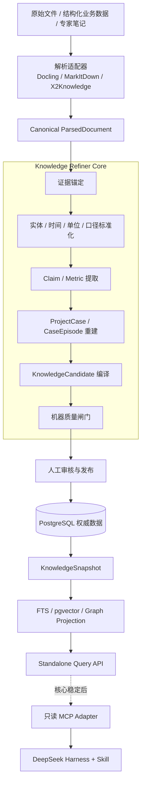

# Hoosland 独立知识提纯库开发文档

文档状态：`Draft for Review`  
文档版本：`0.1.0`  
编写日期：`2026-08-26`  
规范范围：知识提纯核心库、独立服务及其数据契约  
首期业务域：住宅项目研究、产品组合与首开策略  
上位方案：[项目经验知识图谱与专业决策引擎开发文档](KNOWLEDGE-DECISION-SYSTEM-DEVELOPMENT.md)  
集成边界：[ADR-0005：Harness 插件、Skill 与知识层边界](adr/0005-harness-plugin-and-knowledge-boundaries.md)  
配套计划：[独立知识提纯库开发步骤与敏捷实施计划](KNOWLEDGE-REFINERY-CORE-IMPLEMENTATION-PLAN.md)  

## 0. 执行结论

知识提纯库是一个独立的**项目经验编译器**：把历史项目中的原始资料、事实、决策、动作、结果和反例，编译为有证据、有条件、有版本、可审核、可供新项目匹配的 `KnowledgeUnitVersion`。

它不是普通 RAG，不是 Obsidian 替代品，不是 Skill 集合，也不是 DeepSeek Harness 插件。四层职责必须分开：

| 层 | 回答的问题 | 核心产物 |
|---|---|---|
| 原始证据 / RAG 层 | 资料中写了什么 | `ParsedDocument`、`EvidenceSpan` |
| 知识提纯层 | 从项目中学到了什么，在什么条件下可能成立 | `ProjectCase`、`CaseEpisode`、`KnowledgeUnitVersion` |
| Skill 层 | 面对新项目应采用什么专业分析方法 | 工作流、计算规则、检查表、输出契约 |
| Agent / Harness 层 | 本轮如何调用模型、工具和 Skill 完成任务 | Tool 调用、运行状态、分析报告 |

第一条必须跑通的独立链路为：

```text
ParsedDocument
→ EvidenceSpan
→ Claim / MetricObservation
→ ProjectCase / CaseEpisode
→ KnowledgeCandidate
→ Machine Quality Gate
→ Human Review
→ KnowledgeUnitVersion
→ KnowledgeSnapshot
```

核心库必须能够只通过 CLI、pytest 和独立数据库运行。只有提纯质量、审核发布和快照复现达到验收标准后，才开发 MCP/Harness 适配器。

## 1. 建设目标

### 1.1 产品目标

1. 将不同来源的项目资料统一为可定位、可校验的证据。
2. 将证据中的事实、指标、约束、决策、动作和结果结构化。
3. 将单项目经历整理为有时间边界的 `CaseEpisode`。
4. 从一个或多个案例中生成有适用条件、失效条件和反例的候选经验。
5. 通过机器规则与领域专家审核，将候选知识发布为不可变版本。
6. 冻结可复现的知识快照，并以快照为边界服务新项目查询。
7. 对新项目先做硬条件判断，再检索相似经验、反例和冲突知识。
8. 让任何正式知识和后续分析都能回到原始文件的页码、段落或单元格。

### 1.2 首期非目标

- 不在核心库中实现 Agent Loop、会话管理、Skill 路由或最终报告写作。
- 不 fork 或修改 DeepSeek Harness。
- 不把 X2Knowledge、Docling、MarkItDown 的问答对直接当作正式知识。
- 不把向量相似度当作经验适用性。
- 不让 LLM 自动批准、发布、覆盖或废止正式知识。
- 不建立覆盖地产全链路的完整本体，首期只验证一个决策域。
- 不把图数据库作为唯一事实源。
- 不在缺少实际动作和结果时把建议包装成“成功经验”。
- 不在 MVP 阶段开发完整 Obsidian 替代品或复杂知识图谱大屏。

### 1.3 成功定义

对一条用于新项目的经验，系统必须回答：

1. 经验的正式版本是什么；
2. 来自哪些历史项目和案例时点；
3. 原始证据在哪里；
4. 适用于哪些条件；
5. 明确不适用于哪些条件；
6. 有哪些支持案例、反例和冲突知识；
7. 当前新项目满足、违反或缺少哪些条件；
8. 本轮使用了哪个知识快照；
9. 哪部分是事实、推导、推断、假设或建议。

如果以上信息无法提供，系统只能返回待调查线索或原始证据，不能返回正式经验判断。

## 2. 核心设计原则

1. **证据不可变**：原文件版本、内容哈希和 `EvidenceSpan` 不得原地覆盖。
2. **LLM 只生成候选**：模型输出必须经过 Schema 校验、证据校验和人工发布。
3. **适用条件优先**：硬条件失败时，语义相似度不能把知识重新判为适用。
4. **三值条件逻辑**：条件结果为 `true / false / unknown`；`unknown` 默认 `abstain`。
5. **正例与反例并列**：经验发布和新项目匹配都必须主动寻找反例。
6. **时间截断**：历史案例只能使用决策当时已经可获得的信息，禁止未来泄漏。
7. **知识与方法分离**：`KnowledgeUnit` 是版本化数据；Skill 是版本化方法。
8. **关系库为权威源**：PostgreSQL 承担状态、版本、权限和审计；向量、全文和图谱是可重建投影。
9. **追加式版本**：已发布知识不能直接修改，只能创建新版本或新快照。
10. **分数不混用**：知识置信度、项目适用性和检索相似度分别计算和解释。
11. **运行可复现**：来源、解析器、模型、Prompt、流水线、知识和索引版本全部进入运行清单。
12. **核心零集成依赖**：核心包不得导入 Harness、MCP、FastAPI 路由、现有聊天状态或具体供应商 SDK。

## 3. 系统边界与依赖方向

### 3.1 输入

核心库接受标准化输入，不直接假设输入来自某个 UI 或解析器：

- 项目身份、范围、阶段和决策截止时间；
- `ParsedDocument`；
- 来源主体、来源等级、资料日期、有效期和保密等级；
- 决策记录、执行动作和结果观察；
- 人工纠正、审核意见和发布决策。

### 3.2 输出

- 可审核的 `KnowledgeCandidate`；
- 已发布的 `KnowledgeUnitVersion`；
- 不可变的 `KnowledgeSnapshot`；
- `KnowledgeMatch` 和差异矩阵；
- 支持证据、反例、冲突和未知条件；
- 完整血缘和可重放的 `CompilationRun`。

### 3.3 强制依赖方向

```text
MCP / DeepSeek Harness adapter
        ↓ calls
Hoosland Application adapter
        ↓ calls
standalone API / CLI / Worker
        ↓ calls
knowledge_refinery.application ──→ knowledge_refinery.domain
        │
        └── depends on Port protocols
                         ↑ implemented by
              infrastructure adapters
```

Domain 不依赖其他层；Application 只依赖 Domain 和 Port 协议；基础设施 Adapter 实现 Port；外部入口只调用 Application use case。核心层不能反向依赖任何集成层。通过架构测试禁止下列导入：

```text
deepseek_harness
mcp
fastapi
backend.app.harness_adapter
backend.app.main
具体 LLM SDK
具体数据库客户端
```

### 3.4 与文档解析工具的边界

X2Knowledge、Docling、MarkItDown、MinerU、OCR 等属于可替换的上游解析器：

```text
X2Knowledge / Docling / MarkItDown / MinerU
→ ParsedDocument Adapter
→ Canonical ParsedDocument
→ EvidenceSpan
→ Hoosland Knowledge Refiner
```

采用规则：

- 优先直接封装 Docling/MarkItDown；X2Knowledge 可作为解析方案对照或隔离 sidecar。
- 解析器输出必须转成 Hoosland 的 canonical Schema，不能让第三方字段渗透到领域模型。
- X2Knowledge 的“标题作为问题、正文作为答案”只能作为 RAG 预处理数据，不能成为 `KnowledgeUnit`。
- 解析服务不得由 Agent 直接调用；入库 Worker 负责文件处理和资源隔离。
- 生产接入前必须补齐文件名净化、输出目录限制、URL SSRF 防护、超时和资源上限。
- 如复用第三方源码而非仅调用其公开接口，必须单独完成许可证、NOTICE 和依赖安全审查。

### 3.5 与 Obsidian / SiYuan 的边界

Obsidian、SiYuan 等可以作为人工资料整理和专家编辑入口，通过 Markdown Frontmatter、附件、标签和双链 adapter 导入。笔记双链只生成候选关系，不能自动成为正式知识图谱边；审核通过的 `KnowledgeUnitVersion` 仍以权威数据库和快照为准。首期只做导入和只读导出，不做实时双向同步。

## 4. 总体架构



### 4.1 运行形态

开发顺序必须保持以下边界：

1. **库模式**：Python API + SQLite/in-memory adapter + Fake LLM。
2. **独立工具模式**：CLI + pytest + Golden Set。
3. **独立服务模式**：FastAPI 管理 API、查询 API和后台 Worker。
4. **产品集成模式**：Hoosland Application adapter。
5. **Agent 接入模式**：只读 MCP 或薄 Cordis adapter。

删除第 4、5 层后，第 1–3 层仍必须完整可运行。

## 5. 推荐代码结构

推荐基线为 Python 3.11+、Pydantic 2、pytest；持久化 adapter 可采用 SQLAlchemy 2 和 Alembic，Standalone Web adapter 可采用 FastAPI。以上框架都不能进入 Domain 层。

即使继续使用同一 Git 仓库，也应建立独立 Python package：

```text
packages/knowledge-refinery/
├─ pyproject.toml
├─ src/
│  ├─ knowledge_refinery/
│  │  ├─ domain/
│  │  │  ├─ entities.py
│  │  │  ├─ value_objects.py
│  │  │  ├─ enums.py
│  │  │  ├─ policies.py
│  │  │  └─ errors.py
│  │  ├─ application/
│  │  │  ├─ commands/
│  │  │  ├─ queries/
│  │  │  ├─ pipelines/
│  │  │  └─ quality_gates/
│  │  ├─ ports/
│  │  │  ├─ documents.py
│  │  │  ├─ llm.py
│  │  │  ├─ embeddings.py
│  │  │  ├─ repositories.py
│  │  │  ├─ search.py
│  │  │  ├─ storage.py
│  │  │  ├─ jobs.py
│  │  │  └─ clock.py
│  │  ├─ contracts/
│  │  │  ├─ parsed_document.py
│  │  │  ├─ knowledge_unit.py
│  │  │  └─ knowledge_packet.py
│  │  └─ prompts/
│  ├─ knowledge_refinery_adapters/
│  │  ├─ parsers/
│  │  ├─ llm/
│  │  ├─ persistence/
│  │  ├─ search/
│  │  └─ object_store/
│  └─ knowledge_refinery_service/
│     ├─ api/
│     ├─ worker/
│     └─ cli/
├─ migrations/
├─ tests/
│  ├─ unit/
│  ├─ architecture/
│  ├─ contract/
│  ├─ golden/
│  ├─ integration/
│  └─ security/
└─ docs/

integrations/knowledge-mcp/       # 核心 Beta 后创建
backend/app/knowledge_adapter/    # Hoosland 产品接入时创建
```

### 5.1 Domain 层

只包含实体、值对象、状态机和确定性业务规则。不得依赖数据库 ORM、Web 框架、模型 SDK和 Agent 运行时。

### 5.2 Application 层

编排以下用例：

- 注册项目与来源；
- 导入标准文档；
- 启动和重放提纯任务；
- 创建 `ProjectCase`；
- 生成并验证知识候选；
- 提交审核、批准和发布；
- 创建、激活和回滚知识快照；
- 查询知识并匹配新项目。

### 5.3 Ports 与 Adapters

| Port | 责任 | 首个 Adapter |
|---|---|---|
| `DocumentParser` | 原始资料转 `ParsedDocument` | Markdown/JSON fixture，后接 Docling |
| `LLMProvider` | 结构化候选生成 | Fake provider + 一个受控模型 |
| `EmbeddingProvider` | 生成知识级向量 | 首期可为 no-op，MVP 后接入 |
| `Reranker` | 对召回知识排序 | 规则排序，后接模型重排 |
| `KnowledgeRepository` | 权威实体、版本和事务 | SQLite 开发，PostgreSQL 生产 |
| `ObjectStore` | 原文件与解析产物 | 本地受控目录，后接 S3/MinIO |
| `SearchIndex` | FTS、向量和结构化查询 | PostgreSQL FTS/pgvector |
| `GraphProjection` | 可重建关系投影 | 首期 edge table，后接 AGE/其他图引擎 |
| `JobQueue` | 后台任务、重试和恢复 | 内存测试，后接 PostgreSQL Job Table |
| `Clock` | 时间与可重放测试 | System/Frozen clock |

## 6. 核心领域模型

### 6.1 `ParsedDocument`

解析器适配器必须输出统一结构：

```text
document_id
document_version_id
content_hash
source_metadata
parser_name
parser_version
blocks[]
  block_id
  block_type
  text
  section_path
  page_number
  bounding_box
  sheet_name
  cell_range
  original_locator
assets[]
tables[]
warnings[]
```

固定 Token Chunk 可以作为模型调用的临时窗口，但不能替代原始 block 和 locator。

### 6.2 `EvidenceSpan`

证据最小引用单元：

```text
evidence_id
document_version_id
normalized_text
text_hash
locator
section_path
page_number / paragraph_number
sheet_name / cell_range
context_before / context_after
source_grade
effective_scope
as_of_date
```

同一文档版本和相同 locator 必须生成稳定 ID。每个 `EvidenceSpan` 必须可以通过 API 或本地查看器打开并核对原文。

### 6.3 `Claim`

`Claim` 必须保持原子化，尽量只表达一个可以独立核验的主张。沿用现有主张分类：

```text
FACT
DERIVED
INFERENCE
HYPOTHESIS
RECOMMENDATION
```

主要字段：

```text
claim_id
claim_text
claim_type
subject / predicate / object
scope_id
evidence_links[]
formula
input_claim_ids[]
as_of_date
confidence_basis
status
```

证据关系至少包括：`DIRECT_SUPPORT`、`DERIVATION_INPUT`、`CONTRADICTS`、`CONTEXT_ONLY`。

### 6.4 `MetricObservation`

```text
metric_code
raw_value
normalized_value
unit
currency
denominator
period_start / period_end
scope_id
methodology
evidence_id
```

必须同时保存原值、标准化值和转换规则。派生指标必须记录公式和输入 Claim。

### 6.5 `ProjectCase` 与 `ContextSnapshot`

`ProjectCase` 表示某个明确决策时点的历史案例，而不是整个项目的永久摘要：

```text
project_id
case_id
lifecycle_stage
decision_domain
cutoff_at
context_snapshot_id
data_completeness
status
```

`ContextSnapshot` 只包含 `cutoff_at` 之前可获得的事实、假设、约束和市场状态。

### 6.6 `CaseEpisode`

历史经验的基础单元：

```text
项目背景
→ 决策问题
→ 当时可用证据
→ 备选方案与实际决策
→ 实际行动
→ 观察到的结果
→ 观察周期与外部干扰
→ 复盘判断
```

没有实际行动或结果时，只能形成 `HYPOTHESIS` 或 `RECOMMENDATION`，不能标记为已验证经验。

### 6.7 `KnowledgeCandidate`

LLM 或规则引擎产生的候选对象，不能进入生产知识查询：

```text
candidate_id
knowledge_type
proposition
applicability
preconditions
exclusion_conditions
trigger_signals
recommended_action
expected_outcomes
mechanism
failure_modes
exceptions
positive_case_ids
negative_case_ids
supporting_claim_ids
opposing_claim_ids
compilation_run_id
status
```

### 6.8 `KnowledgeUnitVersion`

正式发布的经验版本。建议首期类型：

- `DECISION_PATTERN`
- `RISK_SIGNAL`
- `CAUSAL_HYPOTHESIS`
- `BENCHMARK_RANGE`
- `OPERATING_RULE`
- `FAILURE_PATTERN`
- `COUNTEREXAMPLE`
- `CHECKLIST_ITEM`

最小契约：

```json
{
  "knowledge_unit_id": "KU-0018",
  "knowledge_version_id": "KU-0018-V3",
  "knowledge_type": "DECISION_PATTERN",
  "title": "经验标题",
  "proposition": "单一、可判断的经验陈述",
  "applicability": [],
  "preconditions": [],
  "exclusion_conditions": [],
  "trigger_signals": [],
  "recommended_action": null,
  "expected_outcomes": [],
  "mechanism": null,
  "failure_modes": [],
  "exceptions": [],
  "positive_case_ids": [],
  "negative_case_ids": [],
  "supporting_claim_ids": [],
  "opposing_claim_ids": [],
  "confidence": {
    "level": "medium",
    "source_quality": null,
    "evidence_independence": null,
    "cross_case_support": null,
    "outcome_observed": null,
    "recency": null,
    "conflict_status": null,
    "review_grade": null
  },
  "valid_from": null,
  "valid_to": null,
  "status": "published"
}
```

一条知识单元尽量只表达一个独立判断。单案例观察不得静默升级为普遍规律。

### 6.9 `ConflictSet`

冲突不能通过覆盖或简单平均解决：

```text
conflict_id
member_claim_ids
member_version_ids
conflict_type
possible_scope_difference
possible_time_difference
resolution_status
resolution_rationale
reviewer_id
```

状态为：`UNRESOLVED / CONTEXTUAL / RESOLVED / SUPERSEDED`。

### 6.10 `ReviewRecord` 与 `KnowledgeSnapshot`

`ReviewRecord` 记录审核人、决定、意见、字段改动、质量闸门和时间。

`KnowledgeSnapshot` 是一组明确的正式知识版本清单，不是数据库备份：

```text
snapshot_id
release_version
schema_version
unit_version_ids
source_version_manifest
prompt_versions
pipeline_version
index_version
manifest_hash
created_by
created_at
status
```

### 6.11 三类分数

| 分数 | 含义 | 可以用于什么 |
|---|---|---|
| `confidence` | 经验本身有多可靠 | 审核与风险展示 |
| `applicability` | 经验对当前项目是否适用 | 条件判断和 abstain |
| `retrieval_score` | 查询与知识文本有多相似 | 候选召回和排序 |

三类分数不得互相覆盖。尤其不能用高向量相似度绕过明确的不适用条件。

## 7. 知识提纯流水线

### P0：项目与来源登记

- 确认项目、期次、范围和决策截止时间；
- 计算文件 SHA-256 并建立不可变来源版本；
- 标记来源等级、日期、有效期、权限和保密等级；
- 识别重复文件，但不静默合并不同来源身份。

### P1：格式化与解析

- 解析器产生 canonical `ParsedDocument`；
- 保留标题、段落、页码、表格、单元格、图片和原始位置映射；
- 保存解析器名称、版本、配置、告警和质量分；
- 低质量或不支持文档进入人工处理队列。

### P2：证据锚定

- 按结构和语义边界生成 `EvidenceSpan`；
- 生成稳定 ID、文本哈希和 locator；
- 保存上下文窗口，但引用正文不随重切片改变；
- 验证每个 locator 可以重新打开。

### P3：实体、时间、单位和口径标准化

- 项目、城市、板块、地块、楼栋、产品和主体消歧；
- 面积、金额、价格、比例、周期等单位标准化；
- 保留原始值、转换规则和适用范围；
- 歧义项不得自动合并，进入人工确认。

### P4：原子主张和指标提取

- 使用结构化输出提取原子化 `Claim` 和 `MetricObservation`；
- 每条主张至少引用一个允许列表内的 `evidence_id`；
- 派生数字记录公式和输入主张；
- 推荐、推断、假设不得标记为事实；
- 无法确认的信息明确标记为 `unknown`。

### P5：案例事件重建

- 根据 `cutoff_at` 构建 `ContextSnapshot`；
- 整理“背景—问题—决策—行动—结果—复盘”；
- 记录备选方案、观察周期和混杂因素；
- 缺失的决策、行动或结果保持未知，不使用未来信息补齐。

### P6：合并、去重与冲突检测

- 合并同义主张和重复候选；
- 检查范围、日期、单位和统计口径；
- 区分真实冲突与上下文差异；
- 创建 `ConflictSet`，禁止静默覆盖。

### P7：经验候选生成

- 生成核心判断、适用条件和排除条件；
- 提取触发信号、作用机制、预期结果和失败模式；
- 主动检索支持案例、反例和相反主张；
- 披露单案例、结果缺失、来源相关性等限制；
- 保存模型、Prompt、输入快照和编译器版本。

### P8：机器质量验证

- Schema 和枚举校验；
- 证据 ID、locator 和哈希校验；
- 主张—证据一致性检查；
- 范围、单位、日期、时效和未来泄漏检查；
- 重复、冲突和反例遗漏检查；
- 文档提示注入和敏感信息检查；
- 单案例泛化、无结果升级等领域规则检查。

### P9：人工审核

审核界面必须并排展示：

- 知识陈述、适用条件和排除条件；
- 支持案例、反例和冲突项；
- 原始证据和来源等级；
- 与已有版本的字段差异；
- 模型、Prompt、流水线和规则版本。

### P10：批准与发布

发布事务必须原子完成：

1. 写入新的 `KnowledgeUnitVersion`；
2. 写入审核和发布审计；
3. 写入快照清单或待发布清单；
4. 写入索引 outbox；
5. 原子切换活跃快照指针。

### P11：索引和图谱投影

只从已发布快照构建：

- 结构化字段和全文索引；
- 知识单元级向量索引；
- 正例、反例、条件、冲突和替代关系；
- 可选的 AGE 或其他图谱投影。

投影失败不得破坏权威数据，并且必须能够从快照重建。

### P12：使用反馈回收

记录某次分析使用、忽略或挑战了哪些知识，以及后续实际结果。反馈只能生成新的候选或复审任务，不能直接修改正式知识。

## 8. LLM 与 Prompt 设计

### 8.1 Provider 抽象

生成模型、Embedding 和 Rerank 使用独立端口：

```python
class LLMProvider(Protocol):
    async def generate_structured(
        self,
        task: TaskSpec,
        messages: list[Message],
        response_schema: dict,
        policy: ModelPolicy,
        idempotency_key: str,
    ) -> LLMResult:
        ...
```

`LLMResult` 至少记录：

```text
provider
model
model_revision
prompt_template_id
prompt_template_version
input_hash
output_hash
token_usage
latency
finish_reason
validation_errors
```

### 8.2 运行规则

- 提纯 Prompt 属于知识核心应用资源，不属于 Skill。
- Prompt 和 Schema 必须独立版本化。
- 文档内容始终作为不可信数据，不允许覆盖系统指令。
- 提纯调用默认不开放外部工具，降低提示注入影响。
- 模型引用的 `evidence_id` 必须来自本次允许列表。
- 结构化输出必须经过 Pydantic/JSON Schema 验证。
- 重试必须有限次、可取消并具有幂等键。
- 普通日志不记录文档正文、完整 Prompt、完整模型输出或密钥。
- 根据资料保密等级选择允许的 Provider 和模型。

### 8.3 模型升级门

更换模型、Prompt、温度、输出 Schema 或提纯策略时，必须对 Golden Set 运行回归。出现下列任一情况不得发布：

- 证据悬空或伪造引用增加；
- `FACT / INFERENCE / HYPOTHESIS` 误分类显著回退；
- 关键经验召回下降；
- 反例遗漏增加；
- 人工修改距离超过批准阈值；
- 成本或延迟超过预算且无明确收益。

## 9. 状态、审核与版本

### 9.1 候选状态

```text
DRAFT
→ MACHINE_VALIDATED
→ IN_REVIEW
→ APPROVED / REVISION_REQUIRED / REJECTED
```

### 9.2 正式知识状态

```text
APPROVED
→ PUBLISHED
→ CHALLENGED
→ SUPERSEDED / RETIRED
```

模型不能直接设置 `APPROVED` 或 `PUBLISHED`。

### 9.3 发布闸门

正式发布至少满足：

- 所有关键主张具有可解析证据；
- 不存在悬空来源；
- 适用范围、时间范围和排除条件已声明；
- 冲突已解决或明确披露；
- 事实、推断、假设和建议分类正确；
- 已记录支持案例和反例，或明确标记“尚未发现反例”；
- 高影响知识由具备权限的领域专家审核；
- 未包含越权公开的敏感信息。

### 9.4 版本轴

| 版本 | 作用 |
|---|---|
| `schema_version` | 数据结构版本 |
| `pipeline_version` | 提纯流水线版本 |
| `prompt_version` | Prompt 模板版本 |
| `knowledge_unit_id` | 知识逻辑身份 |
| `knowledge_version_id` | 不可变知识版本 |
| `snapshot_id` | 一组可见知识版本 |
| `index_version` | 可重建检索投影版本 |

回滚通过切换旧快照完成，不通过修改历史记录完成。

## 10. 存储与索引

### 10.1 开发环境

- SQLite 或内存 repository；
- 本地受控对象目录；
- Fake LLM Provider；
- Markdown/JSON Golden Fixture；
- 规则排序或 no-op embedding。

### 10.2 生产环境

| 层 | 推荐方案 | 权威性 |
|---|---|---|
| 领域数据、审核、版本、审计 | PostgreSQL | 权威源 |
| 条件和扩展画像 | JSONB + 关系字段 | 权威源 |
| 原文件与解析产物 | S3/MinIO 或受控磁盘 | 权威源，内容不可变 |
| 全文检索 | PostgreSQL FTS / OpenSearch | 可重建投影 |
| 语义检索 | pgvector | 可重建投影 |
| 知识关系 | PostgreSQL edge table，后接 AGE | 可重建投影 |
| 后台任务 | PostgreSQL Job Table + Worker | 权威任务状态 |

FAISS 或 Chroma 可以用于实验，但不得承担审核、事务、权限、版本和审计的唯一事实源。

## 11. 查询与新项目匹配

### 11.1 查询顺序

1. 租户、用户和项目权限过滤；
2. 知识快照和发布状态过滤；
3. 项目类型、阶段、地区、时间等硬条件过滤；
4. 结构化字段和 FTS 召回；
5. 知识单元级向量召回；
6. 扩展正例、反例、冲突和替代关系；
7. Rerank；
8. 三值适用性检查；
9. 组装受 Token 预算约束的证据包。

### 11.2 查询模式

- `evidence_search`：查询原始证据，用于核验和调查。
- `knowledge_search`：查询已发布知识，用于专业分析。
- `project_match`：将新项目画像与历史经验进行条件比较。

### 11.3 `KnowledgeMatch` 输出

```text
snapshot_id
applicable_experiences
partially_applicable_experiences
non_applicable_experiences
conflicting_experiences
similarities
differences
missing_conditions
risk_signals
recommended_checks
positive_cases
negative_cases
evidence_refs
```

知识服务返回的是经验匹配包，不是最终项目策略。最终分析由专业 Skill 按方法生成，并由 Application Gate 核验。

## 12. 独立接口

### 12.1 Python API

首期稳定的 application use cases：

```text
register_source
import_parsed_document
create_project_case
start_compilation
validate_candidate
submit_for_review
publish_revision
create_snapshot
search_knowledge
match_project
get_lineage
```

### 12.2 CLI

建议命令：

```text
knowledge-refinery validate <file>
knowledge-refinery ingest <parsed-document.json>
knowledge-refinery refine --case <case-id>
knowledge-refinery replay --run <run-id>
knowledge-refinery export-candidates --run <run-id>
knowledge-refinery publish --candidate <id> --review <review-file>
knowledge-refinery snapshot create
knowledge-refinery match --project <project-profile.json>
```

CLI 首先服务于开发、测试和数据运营，不承担面向终端用户的权限界面。

### 12.3 管理写 API

```text
POST /v1/sources
POST /v1/refinement-runs
GET  /v1/refinement-runs/{id}
GET  /v1/candidates
GET  /v1/candidates/{id}
POST /v1/candidates/{id}/review
POST /v1/releases
GET  /v1/snapshots
POST /v1/snapshots/{id}/activate
```

禁止提供把“提取、批准、发布”合并成一个自动接口的快捷路径。

### 12.4 生产只读 API

```text
POST /v1/knowledge/search
POST /v1/knowledge/match
GET  /v1/knowledge/{knowledge_version_id}
GET  /v1/knowledge/{knowledge_version_id}/lineage
GET  /v1/evidence/{evidence_id}
GET  /v1/snapshots/current
```

所有生产查询必须返回实际使用的 `snapshot_id`。

## 13. 与 DeepSeek Harness 和 Skill 的后续接入

核心库达到内部 Beta 后再增加：

```text
DeepSeek Harness
  ├─ Skill：分析方法、工作流和输出规范
  └─ Knowledge MCP Adapter：协议转换和认证
                         ↓
                  Knowledge Query API
                         ↓
                  Knowledge Refiner Core
```

第一批 MCP Tool 控制在四个只读能力：

```text
knowledge.search
knowledge.match_project
knowledge.get_unit
knowledge.get_evidence
```

边界要求：

- Harness 不直接读取知识数据库。
- Skill 不保存大量历史项目内容。
- MCP adapter 不保存领域状态或审核逻辑。
- `refine`、`review`、`publish` 默认不注册为 Agent Tool。
- 提纯任务运行在独立 Worker，不阻塞 Agent 请求链。
- 每次调用返回 `snapshot_id`、知识版本和证据 ID。
- 可以关闭自动路由，仅保留手动 `/kb_compare` 灰度入口。

## 14. 安全与权限

- 所有领域对象绑定 `tenant_id` 和访问策略。
- 权限过滤必须发生在全文和向量召回之前。
- 原始资料、候选知识和正式知识采用不同权限。
- 上传文件名净化，并限制大小、类型、解压比和处理时间。
- API 不接受任意宿主机输出路径。
- 外部 URL 抓取必须限制协议、DNS 解析、重定向和内网地址，防止 SSRF。
- 文档解析和 LLM 提纯运行在受限 Worker 中。
- 资料正文、Prompt 全文和模型完整输出默认不进入普通日志。
- 写操作必须有幂等键；发布采用追加式审计和事务 outbox。
- 数据分级决定可使用的模型、区域和供应商。
- 后台任务支持重试、取消、超时、dead-letter 和断点恢复。
- 索引必须能从正式快照完整重建。

## 15. 测试与评测

### 15.1 测试分层

| 测试 | 重点 |
|---|---|
| Unit | 值对象、状态机、三值条件、版本和质量规则 |
| Architecture | 禁止核心导入 Harness、FastAPI、MCP和具体 Provider |
| Contract | Parser、LLM、Repository、Search adapter 契约 |
| Golden | 固定资料、EvidenceSpan、Claim、CaseEpisode 和 KnowledgeUnit |
| Integration | PostgreSQL、对象存储、Job、发布事务和索引重建 |
| Security | 越权、路径穿越、SSRF、提示注入、恶意文件和日志泄露 |
| Replay | 固定版本输入重放与快照复现 |

### 15.2 初始质量指标

| 指标 | PoC | 内部 Beta | 生产试点 |
|---|---:|---:|---:|
| 已发布主张证据可解析率 | 100% | 100% | 100% |
| 正式知识人工审核率 | 100% | 100% | 100% |
| 悬空引用 | 0 | 0 | 0 |
| FACT 抽取准确率 | ≥ 85% | ≥ 90% | ≥ 95% |
| 决策/结果提取 F1 | ≥ 70% | ≥ 80% | ≥ 85% |
| 关键经验召回率 | ≥ 70% | ≥ 80% | ≥ 90% |
| unsupported claim 比例 | < 10% | < 5% | < 2% |
| 不适用条件漏检率 | 记录基线 | < 10% | < 5% |
| 必须召回反例的命中率 | ≥ 70% | ≥ 85% | ≥ 90% |

质量目标必须由 Golden Set 定义和持续校准，不能只使用模型自评分。

### 15.3 对照实验

至少比较：

1. Skill-only；
2. 原始 RAG + Skill；
3. KnowledgeUnit + Skill；
4. KnowledgeUnit + 反例 + Skill。

评价证据准确性、适用性、反例覆盖、关键风险召回、专家评分、延迟和成本。如果方案 3/4 相对 Skill-only 和原始 RAG 没有稳定增益，不进入自动接入。

## 16. 可观测性与复现

日志默认只记录：

```text
job_id
tenant_id
document_id / case_id
pipeline_stage
provider / model
prompt_version
token_count / cost
latency
result_status
error_code
snapshot_id
```

每个 `CompilationRun` 必须保存：

- 输入来源和证据快照；
- Schema、解析器、流水线、规则和 Prompt 版本；
- Provider、模型、参数和输出哈希；
- 机器质量闸门结果；
- 人工修改和审核记录；
- 最终候选或正式知识版本 ID。

## 17. Definition of Done

一次核心库迭代只有同时满足以下条件才算完成：

- [ ] 领域边界、Schema 和版本变化已记录；
- [ ] 核心包没有 Harness、MCP、FastAPI route 或具体供应商依赖；
- [ ] 新增主张和知识均可追溯到允许的证据；
- [ ] 正例、反例、冲突、过期、未知和时间泄漏有回归用例；
- [ ] 单元、架构、合同、Golden 和集成测试通过；
- [ ] Prompt、模型、Schema 和流水线版本可重放；
- [ ] 数据迁移、索引重建和回滚路径已验证；
- [ ] 日志和错误响应不泄露资料正文或密钥；
- [ ] Feature Flag 和失败回退行为已验证；
- [ ] 文档、CHANGELOG、验收证据和已知限制同步更新。

## 18. 不可违反的业务规则

> 没有证据，只能是待调查线索。  
> 没有实际结果，只能是建议或假设。  
> 没有适用条件，不是可复用经验。  
> 没有反例意识，不是可靠判断。  
> 没有人工审核，不能进入正式知识库。  
> 没有知识快照编号，Agent 结论不可复现。

最终形态是：

```text
固定的独立知识提纯核心
+ 可替换的解析、模型、存储和索引适配器
+ 可审核的 KnowledgeUnit 版本与快照
+ 只读 MCP 接入
+ Skill 驱动的专业分析
```

