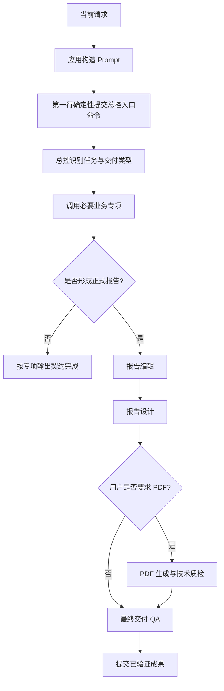

# Skill 编排契约

本文说明 Hoosland 地产研究工作台如何激活总控、调用专项 Skill、形成正式交付链，以及各类保证分别由哪一层提供。它是公开架构说明，不包含部署地址、客户数据、运行标识或私有运维路径。

相关决策：

- [ADR-0001：版本轴独立演进](adr/0001-version-axes.md)
- [ADR-0003：总控优先](adr/0003-controller-first.md)
- [ADR-0004：默认 Markdown + HTML](adr/0004-default-md-html.md)

## 1. 设计目标

编排层需要同时满足四个目标：

1. 每轮都从同一个房地产总控进入，避免单一专项绕过全局范围、证据和交付规则。
2. 总控只调用完成当前任务所需的专项，避免重复加载或多个模块互相调用形成环路。
3. 正式报告遵守稳定的编辑、设计和最终 QA 链，PDF 仅在需要时加入。
4. 能够区分“代码保证”“模型执行契约”“运行审计信号”和“发布前真实验收”，不把提示词要求描述成后端强制事实。

## 2. 角色与职责

套件包含 1 个总控和 10 个专项，共 11 个 Skill。

| 类型 | Skill | 主责 |
|---|---|---|
| 总控 | `comprehensive-real-estate-expert` | 意图识别、范围与证据许可、专项路由、调用去重、交付链编排 |
| 专项 | `real-estate-research` | 城市、板块、规划、土地、市场、竞品、客群与支付研究 |
| 专项 | `real-estate-product-strategy` | 产品定位、面积户配、价格货值和开发推售策略 |
| 专项 | `real-estate-storyline-marketing` | 项目故事线、卖点体系、营销策略和销售表达 |
| 专项 | `real-estate-community-operations` | 客户分层、社群、活动、转化和复盘运营 |
| 专项 | `wechat-article-exporter` | 既有微信文章输入、转换与研究归档 |
| 专项 | `real-estate-report-editorial` | 管理层报告编辑、结论结构和正式文稿 |
| 专项 | `real-estate-report-design` | 信息设计、HTML 和其他视觉介质候选稿 |
| 专项 | `hoosland-pdf-output` | 已审定 HTML 到 PDF 的生成与逐页技术质检 |
| 专项 | `real-estate-delivery-qa` | 内容、证据、隐私、文件与发布条件的最终放行检查 |
| 专项 | `real-estate-social-promotion` | 已审定母稿的社交传播审批包 |

总控不替代专项完成专业判断，专项也不拥有全局编排权。

## 3. 四类保证

### 3.1 后端硬约束

当前应用代码直接保证：

- 每个由应用构造的 Harness Prompt 都把 `/comprehensive-real-estate-expert` 放在第一行。
- 当前用户请求被编码为 JSON 数据，用户自带的 slash 文本不能替换服务端第一行。
- 配置的 Skill 根目录缺少总控文件时，Ready 返回不可用，运行在启动 Harness 前失败。
- 每轮输出审计以运行前后的文件指纹差异区分历史文件和本轮新增或更新文件。

这些约束不等于后端已经实现完整的 Skill 状态机。后端当前不会强制验证每一个专项是否按顺序调用，也不会因缺少默认双格式中的一个文件而自动把成功运行改为失败。

### 3.2 Prompt / Skill 执行契约

System Prompt、每轮交付策略和 Skill 文档共同要求：

- 总控是本轮唯一编排者，不得再通过 `skill` tool 调用自身。
- 单一专项任务也遵守“总控 → 必要专项”。
- 总控维护本轮逻辑上的 `loaded_skills` 集合；同一专项最多加载一次，明确失败后才可重试。
- 子 Skill 只返回结果和下一节点需求，由总控统一决定并调用下游。
- 正式报告遵守“业务专项 → 编辑 → 设计 → 按需 PDF → 最终 QA”。
- 报告类主成果在用户未指定格式时默认生成 Markdown 与独立 HTML。

这些是模型与 Skill 的执行契约。它们受到静态测试和真实 E2E 约束，但不是通用后端工作流引擎强制执行的状态转换。

### 3.3 软审计

运行日志记录两类脱敏信号：

- `agent.controller.injection.prepared`：证明应用已为该轮构造总控入口；它不单独证明 Harness 已成功加载总控。
- `run_output_formats` 与 `default_output_pair_present_this_run`：记录本轮实际新增或更新的文件格式；该布尔值为 `false` 时当前只提供检测信号，不会自动推翻运行终态。

`output_formats` 可能包含对话历史中的既有成果。检测本轮交付必须使用 `run_output_formats`。

### 3.4 E2E 发布闸门

涉及编排或交付契约的发布，应在隔离候选环境验证，并在切换后完成受控生产验收。V0.2 的 E2E 闸门检查了：

- Harness 持久化会话中的用户 Prompt 确实以总控 slash command 开头。
- 总控注入准备事件发生在运行开始前。
- 运行时专项调用链符合该用例的预期顺序，且没有重复或失败调用。
- 默认任务没有误调用 PDF。
- 本轮生成同主名、非空、可下载、可打开的 Markdown 和 HTML。
- HTML 具有有效的 `html` 与 `body` 结构。

E2E 是发布验收，不是每次用户运行都会执行的在线验证器。

## 4. 单轮编排流程



“第一行确定性提交总控入口命令”由应用组装 Prompt 保证；“总控实际加载”需由 Harness 会话或集成验收确认；“识别、调用和去重”由总控执行契约负责。

## 5. 路由规则

### 5.1 单一专项

单一市场研究不是直接从应用进入 Research，而是：

```text
comprehensive-real-estate-expert → real-estate-research
```

总控负责确认范围、证据等级和成果类型，Research 负责研究本身。

### 5.2 跨模块任务

跨研究、产品和营销的任务由总控按依赖顺序调用多个专项。专项不得为了“方便”自行加载另一个专项；发现下游需求时，应把需求返回总控。

### 5.3 正式报告

形成地产研究、项目分析、策划方案或管理报告时，业务专项完成后进入：

```text
real-estate-report-editorial
→ real-estate-report-design
→ [hoosland-pdf-output，仅按需]
→ real-estate-delivery-qa
```

PDF 技术质检不能替代最终 QA。最终 QA 前不得把候选稿描述为已经正式放行。

### 5.4 专项输出例外

以下任务保留各自的输出契约，不因默认报告规则被强制改写：

- 纯澄清、简短问答和不形成文件成果的局部解释。
- 用户明确指定单一格式、其他格式或明确不要文件。
- 微信资料转换或研究归档。
- 社交平台素材与审批包。
- 数据表、模型或其他具有独立格式约定的成果。

如果这些任务同时形成主报告，主报告部分仍适用默认 Markdown + HTML 契约。

## 6. 子 Skill 交接协议

子 Skill 完成职责后，应向已经激活的总控返回：

- 本模块的结构化结果或候选成果；
- 未关闭的证据、范围、计算或质量问题；
- 所需下一节点，例如 `next_skill_requests: [real-estate-report-design]`；
- 当前成果状态，例如研究底稿、编辑候选稿、设计候选稿或待发布审批包。

`next_skill_requests` 当前是 Skill 之间约定的语义协议，不是后端强类型 API。总控仍需判断请求是否适用、是否已经加载以及是否允许重试。

## 7. 调用去重

去重的当前规则是：

1. 总控初始化本轮 `loaded_skills`。
2. 调用专项前检查其是否已经成功加载。
3. 成功加载后加入集合，后续交接不得重复调用。
4. 只有工具明确返回失败，才允许记录原因并重试。
5. 总控自身永远不进入 `skill` tool 调用序列。

运行日志中的 `call_id` 可用于 E2E 去重统计，但应用目前没有在服务端维护一份强制性的 Skill 调用集合。

## 8. 输出契约

当本轮主成果属于报告类且用户未指定最终格式时：

- 在 `outputs` 中生成内容对应的 Markdown 和独立 HTML。
- 两个文件均应非空、可打开；发布 E2E 还要求同主名。
- HTML 应是可独立阅读的文档，而不是只包含外部依赖或跳转的壳。
- 默认不生成 PDF。
- 宣布完成前应检查要求的文件实际存在。

当前后端会审计本轮扩展名集合，但不会强制同主名、内容等价或在线阻断缺失文件。参见 [ADR-0004](adr/0004-default-md-html.md)。

## 9. 扩展新 Skill 的检查清单

新增或改变 Skill 时至少检查：

- [ ] 明确它是总控还是专项；当前架构只允许一个总控。
- [ ] 专项描述说明由总控调用，不得成为工作台直接入口。
- [ ] 不直接调用总控自身或其他专项。
- [ ] 明确输入、输出、证据边界和候选成果状态。
- [ ] 需要下游时返回下一节点需求。
- [ ] 更新总控路由表与 Skill manifest。
- [ ] 更新 smoke tests，检查引用、入口禁令和交接规则。
- [ ] 为新增分支增加真实 E2E，而不是只检查 Prompt 文本。
- [ ] 若改变全局规则，按 ADR-0001 升级对应版本轴。

## 10. 禁止的实现方式

- 由 API 根据关键词直接选择某个专项，绕过总控。
- 让总控通过 `skill` tool 再次调用自己。
- 让 Editorial、Design、PDF、Social 或其他专项直接串联下游。
- 把 `agent.controller.injection.prepared` 当成总控已实际加载的唯一证据。
- 用历史 `output_formats` 冒充本轮双格式交付。
- 因 Prompt 中写了“必须”就声称后端已实现强制状态机。
- 把 PDF 生成成功等同于内容和发布 QA 已通过。

